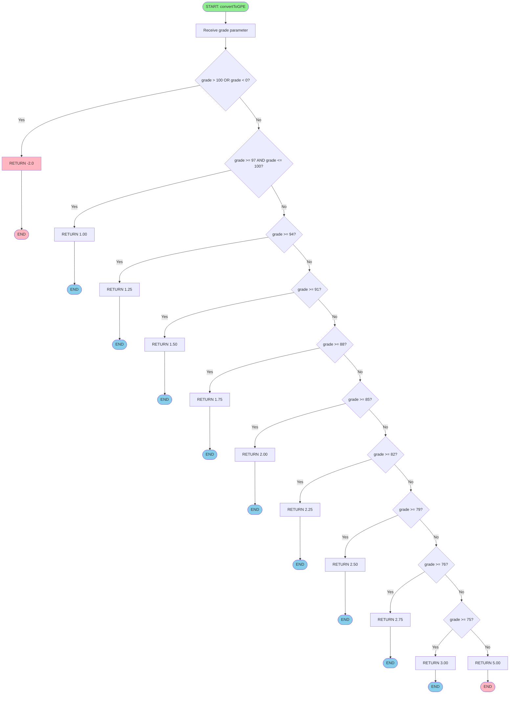

# Student Grade Point Equivalence System
## Algorithm, Pseudocode, and Flowchart

---

## 1. ALGORITHM

### Main Algorithm:
1. **Define** 4 subjects (Math, Science, English, History)
2. **Display** the program title
3. **For each subject:**
   - Ask user to enter grade
   - Read the grade
   - Convert grade to GPE (Grade Point Equivalence)
   - Store grade and GPE
4. **Calculate** the average of all grades
5. **Convert** the average to GPE
6. **Display** a table showing:
   - Subject name, Grade, and GPE for each subject
   - Average grade and final GPE

### ConvertToGPE Algorithm:
1. **Check** grade ranges in descending order:
   - If grade >= 97 and <= 100: return 1.00
   - Else if grade >= 94: return 1.25
   - Else if grade >= 91: return 1.50
   - Else if grade >= 88: return 1.75
   - Else if grade >= 85: return 2.00
   - Else if grade >= 82: return 2.25
   - Else if grade >= 79: return 2.50
   - Else if grade >= 76: return 2.75
   - Else if grade >= 75: return 3.00
   - Else: return 5.00 (failing grade)

---

## 2. PSEUDOCODE

### Main Program:

```
Let numSubjects = 4
Let subjects = ["Math", "Science", "English", "History"]
Let grade[4] = 0, gpe[4] = 0
Let sum = 0, average = 0, averageGPE = 0

Output "===== GRADE POINT EQUIVALENCE SYSTEM ====="

For i = 0 to numSubjects-1:
    Output "Enter grade for " + subjects[i] + ": "
    Input grade[i]
    gpe[i] = convertToGPE(grade[i])

For i = 0 to numSubjects-1:
    sum = sum + grade[i]

average = sum / numSubjects
averageGPE = convertToGPE(average)

Output "=========================================="
Output "Subject" + "Grade" + "GPE"
Output "------------------------------------------"

For i = 0 to numSubjects-1:
    Output subjects[i] + grade[i] + gpe[i]

Output "------------------------------------------"
Output "Average" + average + averageGPE
Output "=========================================="
```

### ConvertToGPE Function:

```
Function convertToGPE(grade):
    If grade >= 97 AND grade <= 100:
        Return 1.00
    Else If grade >= 94:
        Return 1.25
    Else If grade >= 91:
        Return 1.50
    Else If grade >= 88:
        Return 1.75
    Else If grade >= 85:
        Return 2.00
    Else If grade >= 82:
        Return 2.25
    Else If grade >= 79:
        Return 2.50
    Else If grade >= 76:
        Return 2.75
    Else If grade >= 75:
        Return 3.00
    Else:
        Return 5.00
```

---

## 3. FLOWCHART

```mermaid
flowchart TD
    Start([START]) --> Init1[Initialize subject list]
    Init1 --> Init2[Set n = number of subjects]
    Init2 --> Init3[Create arrays: grade[n], gpe[n]]
    Init3 --> DisplayTitle[Display Program Title]
    DisplayTitle --> InitLoop[Set i = 0]
    
    InitLoop --> CheckLoop{i < n?}
    CheckLoop -->|Yes| Prompt[Display: Enter grade in subject[i]]
    Prompt --> ReadGrade[Read grade[i]]
    ReadGrade --> Validate1{grade[i] > 100 OR grade[i] < 0?}
    
    Validate1 -->|Yes| Error1[Display Error Message]
    Error1 --> End1([END - Error Code 1])
    
    Validate1 -->|No| CallGPE[Call convertToGPE grade[i]]
    CallGPE --> StoreGPE[Store result in gpe[i]]
    StoreGPE --> CheckGPE{gpe[i] < 0?}
    
    CheckGPE -->|Yes| Error2[Display Error Message]
    Error2 --> End2([END - Error Code 1])
    
    CheckGPE -->|No| Increment[i = i + 1]
    Increment --> CheckLoop
    
    CheckLoop -->|No| CalcSum[Initialize sum = 0]
    CalcSum --> InitSumLoop[Set j = 0]
    InitSumLoop --> CheckSumLoop{j < n?}
    CheckSumLoop -->|Yes| AddGrade[sum = sum + grade[j]]
    AddGrade --> IncJ[j = j + 1]
    IncJ --> CheckSumLoop
    CheckSumLoop -->|No| CalcAvg[average = sum / n]
    
    CalcAvg --> CallFinalGPE[Call convertToGPE average]
    CallFinalGPE --> StoreFinalGPE[Store result in finalGPE]
    StoreFinalGPE --> ValidateFinal{finalGPE < 0?}
    
    ValidateFinal -->|Yes| Error3[Display Error Message]
    Error3 --> End3([END - Error Code 1])
    
    ValidateFinal -->|No| DisplayHeader[Display Table Header]
    DisplayHeader --> DisplayLine[Display Separator Line]
    DisplayLine --> InitDisplayLoop[Set k = 0]
    
    InitDisplayLoop --> CheckDisplayLoop{k < n?}
    CheckDisplayLoop -->|Yes| DisplayRow[Display: subject[k], grade[k], gpe[k]]
    DisplayRow --> IncK[k = k + 1]
    IncK --> CheckDisplayLoop
    CheckDisplayLoop -->|No| DisplaySep[Display Separator Line]
    
    DisplaySep --> DisplayAvg[Display: Average, average, finalGPE]
    DisplayAvg --> DisplayEnd[Display End Separator]
    DisplayEnd --> EndSuccess([END - Success Code 0])
    
    style Start fill:#90EE90
    style End1 fill:#FFB6C1
    style End2 fill:#FFB6C1
    style End3 fill:#FFB6C1
    style EndSuccess fill:#90EE90
```

### ConvertToGPE Function Flowchart:



---

## GPE Conversion Table

| Grade Range | GPE Value |
|-------------|-----------|
| 97 - 100    | 1.00      |
| 94 - 96     | 1.25      |
| 91 - 93     | 1.50      |
| 88 - 90     | 1.75      |
| 85 - 87     | 2.00      |
| 82 - 84     | 2.25      |
| 79 - 81     | 2.50      |
| 76 - 78     | 2.75      |
| 75 - 75.99  | 3.00      |
| Below 75    | 5.00      |

---

## Notes:
- The flowcharts use Mermaid syntax and can be rendered in Markdown viewers that support it (GitHub, GitLab, etc.)
- For text-based flowcharts, the structure follows standard flowchart conventions:
  - Rectangles = Process/Operation
  - Diamonds = Decision/Condition
  - Ovals = Start/End
  - Arrows = Flow direction

