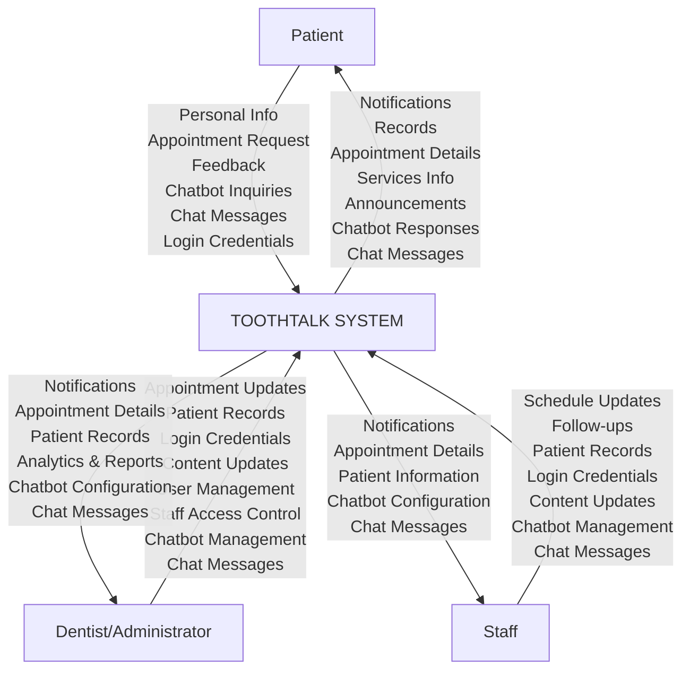

```mermaid
flowchart TD
    Patient[Patient]
    DB[(D1: Toothtalk_db)]
    
    P1[1. Login]
    P2[2. Dashboard]
    P3[3. Calendar]
    P4[4. Profile]
    P5[5. Patient Records]
    P6[6. Announcement]
    P7[7. ToothTalk Chatbot]
    P8[8. Notification]
    P9[9. Chat]
    P10[10. Feedback]
    
    Patient -->|Input Login Requirements| P1
    P1 -->|Confirmation<br/>System Access| Patient
    P1 <-->|Access Rights| DB
    P1 -->|System Access| P2
    P1 -->|System Access| P3
    P1 -->|System Access| P4
    P1 -->|System Access| P5
    P1 -->|System Access| P6
    P1 -->|System Access| P7
    P1 -->|System Access| P8
    P1 -->|System Access| P9
    P1 -->|System Access| P10
    
    Patient -->|Access| P2
    P2 -->|View Services and Overview| Patient
    P2 <-->|List of Stored Services| DB
    
    Patient -->|Submit Appointment Request<br/>View Appointment & Status| P3
    P3 -->|Appointment Details<br/>Calendar View| Patient
    P3 <-->|Appointment Requests<br/>Appointment Data| DB
    
    Patient -->|Edit Profile<br/>View Personal Information| P4
    P4 -->|Updated Profile Information| Patient
    P4 <-->|Stored Patient Data<br/>Updated Profile| DB
    
    Patient -->|View Records<br/>Download Files<br/>View History & Progress Notes| P5
    P5 -->|Patient Records<br/>Medical History<br/>Dental History<br/>Progress Notes| Patient
    P5 <-->|Patient Records<br/>Patient Histories<br/>Progress Notes| DB
    
    Patient -->|Access| P6
    P6 -->|View Announcements| Patient
    P6 <-->|Announcement Data| DB
    
    Patient -->|Inquiries| P7
    P7 -->|Chatbot Responses| Patient
    P7 <-->|Pre-Generated Prompts<br/>FAQ Data| DB
    
    Patient -->|View/Read<br/>Mark as Read/Unread| P8
    P8 -->|Notifications| Patient
    P8 <-->|Notification Triggers<br/>Notification Data| DB
    
    Patient -->|Manage Conversations<br/>Send Messages| P9
    P9 -->|Chat Messages<br/>Conversations| Patient
    P9 <-->|Chat Data| DB
    
    Patient -->|Submit Feedback<br/>Rate Appointments| P10
    P10 -->|Feedback Confirmation| Patient
    P10 <-->|Feedback Data<br/>Appointment Ratings| DB
```

```mermaid
flowchart TD
    Staff[Staff]
    DB[(D1: Toothtalk_db)]
    
    S1[1. Login]
    S2[2. Dashboard]
    S3[3. Patient Records Access]
    S4[4. Post-Procedural Forms]
    S5[5. Appointment]
    S6[6. Blocked Time]
    S7[7. Content Management]
    S8[8. ToothTalk Management]
    S9[9. Account Management]
    S10[10. Notification]
    S11[11. Profile]
    S12[12. Chat]
    S13[13. Feedback]
    
    Staff -->|Input Login Requirements| S1
    S1 -->|Confirmation<br/>System Access| Staff
    S1 <-->|Access Rights| DB
    S1 -->|System Access| S2
    S1 -->|System Access| S3
    S1 -->|System Access| S4
    S1 -->|System Access| S5
    S1 -->|System Access| S6
    S1 -->|System Access| S7
    S1 -->|System Access| S8
    S1 -->|System Access| S9
    S1 -->|System Access| S10
    S1 -->|System Access| S11
    S1 -->|System Access| S12
    S1 -->|System Access| S13
    
    Staff -->|Access| S2
    S2 -->|View Analytics & Report| Staff
    S2 <-->|Analytics & Report Data| DB
    
    Staff -->|Search Patients<br/>View Patient Records<br/>Export Records| S3
    S3 -->|Patient Records<br/>Patient Details| Staff
    S3 <-->|Patient Records Data| DB
    
    Staff -->|CRUD Operations<br/>Manage Forms & Records| S4
    S4 -->|Form Records<br/>Patient Histories<br/>Progress Notes| Staff
    S4 <-->|Post-Procedural Data| DB
    
    Staff -->|CRUD Operations<br/>Manage Appointments| S5
    S5 -->|Appointment Calendar<br/>Appointment Details| Staff
    S5 <-->|Appointment Data| DB
    
    Staff -->|Block Time Slots<br/>Manage Clinic Hours| S6
    S6 -->|Blocked Time Schedule| Staff
    S6 <-->|Blocked Time Data| DB
    
    Staff -->|CRUD Operations<br/>Manage Content| S7
    S7 -->|Announcements<br/>Services<br/>Events<br/>Mail Templates| Staff
    S7 <-->|Content Management Data| DB
    
    Staff -->|Manage FAQ<br/>Configure Settings| S8
    S8 -->|Chatbot Settings<br/>FAQ Entries| Staff
    S8 <-->|Chatbot Data| DB
    
    Staff -->|CRUD Operations<br/>Manage Patient Accounts| S9
    S9 -->|Patient Account Info| Staff
    S9 <-->|Patient Account Data| DB
    
    Staff -->|View/Read<br/>Approve/Deny Requests| S10
    S10 -->|Notifications<br/>Appointment Requests| Staff
    S10 <-->|Notification Data| DB
    
    Staff -->|Edit Profile<br/>Update Password| S11
    S11 -->|Updated Profile| Staff
    S11 <-->|Staff Profile Data| DB
    
    Staff -->|Manage Conversations<br/>Send Messages| S12
    S12 -->|Chat Messages<br/>Conversations| Staff
    S12 <-->|Chat Data| DB
    
    Staff -->|View Feedback| S13
    S13 -->|Feedback Reports| Staff
    S13 <-->|Feedback Data| DB
```

```mermaid
flowchart TD
    Admin[Administrator]
    DB[(D1: Toothtalk_db)]
    
    A1[1. Login]
    A2[2. Dashboard]
    A3[3. Account Management]
    A4[4. Staff Access Control]
    A5[5. Appointment]
    A6[6. Blocked Time]
    A7[7. Content Management]
    A8[8. Post-Procedural Forms]
    A9[9. ToothTalk Management]
    A10[10. Notification]
    A11[11. Profile]
    A12[12. Activity Logs]
    A13[13. Chat]
    A14[14. Feedback]
    
    Admin -->|Input Login Requirements| A1
    A1 -->|Confirmation<br/>System Access| Admin
    A1 <-->|Access Rights| DB
    A1 -->|System Access| A2
    A1 -->|System Access| A3
    A1 -->|System Access| A4
    A1 -->|System Access| A5
    A1 -->|System Access| A6
    A1 -->|System Access| A7
    A1 -->|System Access| A8
    A1 -->|System Access| A9
    A1 -->|System Access| A10
    A1 -->|System Access| A11
    A1 -->|System Access| A12
    A1 -->|System Access| A13
    A1 -->|System Access| A14
    
    Admin -->|Access| A2
    A2 -->|View Analytics & Report| Admin
    A2 <-->|Analytics & Report Data| DB
    
    Admin -->|CRUD Operations<br/>Manage Patient & Staff Accounts| A3
    A3 -->|Patient & Staff Information<br/>Added User| Admin
    A3 <-->|Patient & Staff Data| DB
    
    Admin -->|Manage Staff Permissions<br/>Configure Access Control| A4
    A4 -->|Staff Access Control Settings| Admin
    A4 <-->|Staff Access Control Data| DB
    
    Admin -->|CRUD Operations<br/>Manage Appointments| A5
    A5 -->|Appointment Calendar<br/>Appointment Details| Admin
    A5 <-->|Appointment Data| DB
    
    Admin -->|Block Time Slots<br/>Manage Clinic Hours| A6
    A6 -->|Blocked Time Schedule| Admin
    A6 <-->|Blocked Time Data| DB
    
    Admin -->|CRUD Operations<br/>Manage Content| A7
    A7 -->|Announcements<br/>Services<br/>Events<br/>Mail Templates| Admin
    A7 <-->|Content Management Data| DB
    
    Admin -->|CRUD Operations<br/>Manage Forms & Records| A8
    A8 -->|Form Records<br/>Patient Histories<br/>Progress Notes| Admin
    A8 <-->|Post-Procedural Data| DB
    
    Admin -->|Manage FAQ<br/>Configure Settings| A9
    A9 -->|Chatbot Settings<br/>FAQ Entries| Admin
    A9 <-->|Chatbot Data| DB
    
    Admin -->|View/Read<br/>Approve/Deny Requests| A10
    A10 -->|Notifications<br/>Appointment Requests| Admin
    A10 <-->|Notification Data| DB
    
    Admin -->|Edit Profile<br/>Update Password| A11
    A11 -->|Updated Profile| Admin
    A11 <-->|Admin Profile Data| DB
    
    Admin -->|View/Filter| A12
    A12 -->|Activity Log Data<br/>Staff Activities<br/>System Events| Admin
    A12 <-->|Activity Log Data| DB
    
    Admin -->|Manage Conversations<br/>Send Messages| A13
    A13 -->|Chat Messages<br/>Conversations| Admin
    A13 <-->|Chat Data| DB
    
    Admin -->|View Feedback| A14
    A14 -->|Feedback Reports| Admin
    A14 <-->|Feedback Data| DB
```

# Data Flow Diagrams (DFD)
## ToothTalk Web Application - JValera Dental Clinic

> **Note:** These DFDs are based on the actual system implementation as found in the codebase, including routes, controllers, models, and database structure.

---

## Table of Contents
1. [DFD Level 0 - Context Diagram](#dfd-level-0---context-diagram)
2. [DFD Level 1 - Patient Side](#dfd-level-1---patient-side)
3. [DFD Level 1 - Staff Side](#dfd-level-1---staff-side)
4. [DFD Level 1 - Admin Side](#dfd-level-1---admin-side)

---

## System Overview

### Actual System Processes by Role

**Patient Side (10 Processes):**
1. Login/Authentication
2. Dashboard
3. Calendar (Appointment Requests)
4. Profile Management
5. Patient Records (Records, History, Progress Notes)
6. Announcement
7. ToothTalk Chatbot
8. Notification
9. Chat System
10. Feedback

**Staff Side (13 Processes):**
1. Login/Authentication
2. Dashboard
3. Patient Records Access
4. Post-Procedural Forms
5. Appointment Management
6. Blocked Time Management
7. Content Management
8. ToothTalk Management
9. Account Management (Patients Only)
10. Notification
11. Profile Management
12. Chat System
13. Feedback

**Admin Side (14 Processes):**
1. Login/Authentication
2. Dashboard
3. Account Management (Patients & Staff)
4. Staff Access Control
5. Appointment Management
6. Blocked Time Management
7. Content Management
8. Post-Procedural Forms
9. ToothTalk Management
10. Notification
11. Profile Management
12. Activity Logs
13. Chat System
14. Feedback

---

## DFD Level 0 - Context Diagram

### Mermaid Diagram



### ASCII Diagram Representation

```
┌─────────────┐
│   Patient   │
└──────┬──────┘
       │
       │ Personal Info
       │ Appointment Request
       │ Feedback
       │ Chatbot Inquiries
       │ Chat Messages
       │ Login Credentials
       │
       │ Notifications
       │ Records
       │ Appointment Details
       │ Services Info
       │ Announcements
       │ Chatbot Responses
       │ Chat Messages
       │
       ▼
┌─────────────────────────────────────────────────────────┐
│                                                         │
│                    TOOTHTALK SYSTEM                     │
│                                                         │
│                                                         │
└─────────────────────────────────────────────────────────┘
       ▲
       │
       │ Appointment Updates
       │ Patient Records
       │ Login Credentials
       │ Content Updates
       │ User Management
       │ Staff Access Control
       │ Chatbot Management
       │ Chat Messages
       │
       │ Notifications
       │ Appointment Details
       │ Patient Records
       │ Analytics & Reports
       │ Chatbot Configuration
       │ Chat Messages
       │
┌──────┴──────┐
│  Dentist/   │
│Administrator│
└─────────────┘

       ▲
       │
       │ Schedule Updates
       │ Follow-ups
       │ Patient Records
       │ Login Credentials
       │ Content Updates
       │ Chatbot Management
       │ Chat Messages
       │
       │ Notifications
       │ Appointment Details
       │ Patient Information
       │ Chatbot Configuration
       │ Chat Messages
       │
┌──────┴──────┐
│    Staff    │
└─────────────┘
```

### Data Flow Notation

**Patient ↔ ToothTalk System:**
- Patient -> Personal Info -> ToothTalk System
- Patient -> Appointment Request -> ToothTalk System
- Patient -> Feedback -> ToothTalk System
- Patient -> Chatbot Inquiries -> ToothTalk System
- Patient -> Chat Messages -> ToothTalk System
- Patient -> Login Credentials -> ToothTalk System
- ToothTalk System -> Notifications -> Patient
- ToothTalk System -> Records -> Patient
- ToothTalk System -> Appointment Details -> Patient
- ToothTalk System -> Services Info -> Patient
- ToothTalk System -> Announcements -> Patient
- ToothTalk System -> Chatbot Responses -> Patient
- ToothTalk System -> Chat Messages -> Patient

**Dentist/Administrator ↔ ToothTalk System:**
- Dentist/Administrator -> Appointment Updates -> ToothTalk System
- Dentist/Administrator -> Patient Records -> ToothTalk System
- Dentist/Administrator -> Login Credentials -> ToothTalk System
- Dentist/Administrator -> Content Updates -> ToothTalk System
- Dentist/Administrator -> User Management -> ToothTalk System
- Dentist/Administrator -> Staff Access Control -> ToothTalk System
- Dentist/Administrator -> Chatbot Management -> ToothTalk System
- Dentist/Administrator -> Chat Messages -> ToothTalk System
- ToothTalk System -> Notifications -> Dentist/Administrator
- ToothTalk System -> Appointment Details -> Dentist/Administrator
- ToothTalk System -> Patient Records -> Dentist/Administrator
- ToothTalk System -> Analytics & Reports -> Dentist/Administrator
- ToothTalk System -> Chatbot Configuration -> Dentist/Administrator
- ToothTalk System -> Chat Messages -> Dentist/Administrator

**Staff ↔ ToothTalk System:**
- Staff -> Schedule Updates -> ToothTalk System
- Staff -> Follow-ups -> ToothTalk System
- Staff -> Patient Records -> ToothTalk System
- Staff -> Login Credentials -> ToothTalk System
- Staff -> Content Updates -> ToothTalk System
- Staff -> Chatbot Management -> ToothTalk System
- Staff -> Chat Messages -> ToothTalk System
- ToothTalk System -> Notifications -> Staff
- ToothTalk System -> Appointment Details -> Staff
- ToothTalk System -> Patient Information -> Staff
- ToothTalk System -> Chatbot Configuration -> Staff
- ToothTalk System -> Chat Messages -> Staff

### Description

**DFD Level 0 - Context Diagram for ToothTalk System**

This DFD Level 0 represents the Context Process of the ToothTalk System for JValera Dental Clinic, illustrating high-level data flows between three external entities (Patient, Dentist/Administrator, Staff) and the central ToothTalk System.

The Patient entity sends personal information, appointment requests (new, rescheduling, walk-in), feedback and ratings, chatbot inquiries, chat messages, and login credentials. The system provides notifications, medical records (dental history, progress notes, post-procedural forms), appointment details and calendar information, services information and announcements, chatbot responses, and chat messages.

The Dentist/Administrator entity sends appointment updates (approvals, cancellations, modifications), patient records (clinical notes, treatment plans), login credentials, content updates (announcements, services, events), user management operations, staff access control configurations, chatbot management (FAQ, settings), and chat messages. The system provides notifications, appointment schedules, patient records and treatment history, analytics and reports (dashboard statistics, activity logs), chatbot configuration, and chat messages.

The Staff entity sends schedule updates (appointment scheduling, time blocking), follow-ups, patient records (updates, medical history, progress notes), login credentials, content updates (announcements, services), chatbot management, and chat messages. The system provides notifications, appointment schedules, patient information (demographics, contact info, basic records), chatbot configuration, and chat messages.

The ToothTalk system serves as the central processing unit managing all interactions, maintaining data integrity, security, and workflow coordination across all user roles with appropriate access controls and data protection.

---

## DFD Level 1 - Patient Side

### Mermaid Diagram



### Data Flow Notation

**Process 1 - Login:**
- Patient -> Input Login Requirements -> P1 Login
- P1 Login -> Confirmation -> Patient
- P1 Login -> System Access -> Patient
- P1 Login <- Access Rights <- D1 Toothtalk_db
- P1 Login -> System Access -> P2 Dashboard, P3 Calendar, P4 Profile, P5 Patient Records, P6 Announcement, P7 ToothTalk Chatbot, P8 Notification, P9 Chat, P10 Feedback

**Process 2 - Dashboard:**
- Patient -> Access -> P2 Dashboard
- P2 Dashboard -> View Services and Overview -> Patient
- P2 Dashboard <- List of Stored Services <- D1 Toothtalk_db

**Process 3 - Calendar:**
- Patient -> Submit Appointment Request -> P3 Calendar
- Patient -> View Appointment & Status -> P3 Calendar
- P3 Calendar -> Appointment Details -> Patient
- P3 Calendar -> Calendar View -> Patient
- P3 Calendar <- Appointment Data <- D1 Toothtalk_db
- P3 Calendar -> Appointment Request -> D1 Toothtalk_db

**Process 4 - Profile:**
- Patient -> Edit Profile -> P4 Profile
- Patient -> View Personal Information -> P4 Profile
- P4 Profile -> Updated Profile Information -> Patient
- P4 Profile <- Stored Patient Data <- D1 Toothtalk_db
- P4 Profile -> Updated Profile -> D1 Toothtalk_db

**Process 5 - Patient Records:**
- Patient -> View Records -> P5 Patient Records
- Patient -> Download Files -> P5 Patient Records
- Patient -> View History & Progress Notes -> P5 Patient Records
- P5 Patient Records -> Patient Records -> Patient
- P5 Patient Records -> Medical History -> Patient
- P5 Patient Records -> Dental History -> Patient
- P5 Patient Records -> Progress Notes -> Patient
- P5 Patient Records <- Patient Records <- D1 Toothtalk_db
- P5 Patient Records <- Patient Histories <- D1 Toothtalk_db
- P5 Patient Records <- Progress Notes <- D1 Toothtalk_db

**Process 6 - Announcement:**
- Patient -> Access -> P6 Announcement
- P6 Announcement -> View Announcements -> Patient
- P6 Announcement <- Announcement Data <- D1 Toothtalk_db

**Process 7 - ToothTalk Chatbot:**
- Patient -> Inquiries -> P7 ToothTalk Chatbot
- P7 ToothTalk Chatbot -> Chatbot Responses -> Patient
- P7 ToothTalk Chatbot <- Pre-Generated Prompts <- D1 Toothtalk_db
- P7 ToothTalk Chatbot <- FAQ Data <- D1 Toothtalk_db

**Process 8 - Notification:**
- Patient -> View/Read -> P8 Notification
- Patient -> Mark as Read/Unread -> P8 Notification
- P8 Notification -> Notifications -> Patient
- P8 Notification <- Notification Triggers <- D1 Toothtalk_db
- P8 Notification <- Notification Data <- D1 Toothtalk_db
- P8 Notification -> Notification Status Updates -> D1 Toothtalk_db

**Process 9 - Chat:**
- Patient -> Manage Conversations -> P9 Chat
- Patient -> Send Messages -> P9 Chat
- P9 Chat -> Chat Messages -> Patient
- P9 Chat -> Conversations -> Patient
- P9 Chat <- Chat Data <- D1 Toothtalk_db
- P9 Chat -> Chat Data -> D1 Toothtalk_db

**Process 10 - Feedback:**
- Patient -> Submit Feedback -> P10 Feedback
- Patient -> Rate Appointments -> P10 Feedback
- P10 Feedback -> Feedback Confirmation -> Patient
- P10 Feedback <- Feedback Data <- D1 Toothtalk_db
- P10 Feedback <- Appointment Ratings <- D1 Toothtalk_db
- P10 Feedback -> Feedback Data -> D1 Toothtalk_db

### ASCII Diagram Representation

```
┌─────────┐
│ Patient │
└────┬────┘
     │
     │ Input Login Requirements
     │──────────────────────────────┐
     │                              │
     │                              ▼
     │                    ┌─────────────────┐
     │                    │  1. Login       │
     │                    └────────┬────────┘
     │                             │
     │                    Confirmation      │
     │                    System Access     │
     │                             │
     │                             │ System Access
     │                             │ (to all processes)
     │                             │
     │                             ▼
     │                    ┌─────────────────┐
     │                    │ 2. Dashboard    │
     │                    └────────┬────────┘
     │                             │
     │                    View Services     │
     │                             │
     │                             ▼
     │                    ┌─────────────────┐
     │                    │ 3. Announcement │
     │                    └────────┬────────┘
     │                             │
     │                    View Announcements│
     │                             │
     │                             ▼
     │                    ┌─────────────────┐
     │                    │  4. Calendar    │
     │                    └────────┬────────┘
     │                             │
     │ Request Reschedule           │
     │ View Appointment & Status    │
     │                    Calendar Info     │
     │                             │
     │                             ▼
     │                    ┌─────────────────┐
     │                    │  5. Record      │
     │                    └────────┬────────┘
     │                             │
     │ Download Files              │
     │ View Dental Records         │
     │                    Records & Files   │
     │                             │
     │                             ▼
     │                    ┌─────────────────┐
     │                    │ 6. Notification │
     │                    └────────┬────────┘
     │                             │
     │ View/Read                    │
     │ Notify                       │
     │                    Notifications     │
     │                             │
     │                             ▼
     │                    ┌─────────────────┐
     │                    │  7. Account     │
     │                    └────────┬────────┘
     │                             │
     │ Edit Profile                │
     │ View Personal Info          │
     │                    Profile Info      │
     │                             │
     │                             ▼
     │                    ┌─────────────────┐
     │                    │  7. ToothTalk   │
     │                    │    Chatbot      │
     │                    └────────┬────────┘
     │                             │
     │ Inquiries                   │
     │                    Chatbot Responses│
     │                             │
     │                             ▼
     │                    ┌─────────────────┐
     │                    │  8. Notification│
     │                    └────────┬────────┘
     │                             │
     │ View/Read                    │
     │ Mark as Read/Unread          │
     │                    Notifications     │
     │                             │
     │                             ▼
     │                    ┌─────────────────┐
     │                    │  9. Chat        │
     │                    └────────┬────────┘
     │                             │
     │ Manage Conversations        │
     │ Send Messages               │
     │                    Chat Messages     │
     │                    Conversations     │
     │                             │
     │                             ▼
     │                    ┌─────────────────┐
     │                    │ 10. Feedback    │
     │                    └────────┬────────┘
     │                             │
     │ Submit Feedback             │
     │ Rate Appointments           │
     │                    Feedback Confirmation│
     │                             │
     │                             │
     │                    ┌────────┴────────┐
     │                    │                 │
     │                    │  D1: Toothtalk_db│
     │                    │                 │
     │                    └─────────────────┘
     │
     │ Data Store Interactions:
     │ - Access Rights (Login ↔ DB)
     │ - List of Stored Services (Dashboard ↔ DB)
     │ - Announcement Data (Announcement ↔ DB)
     │ - Appointment Data (Calendar ↔ DB)
     │ - Patient Records, Histories, Progress Notes (Patient Records ↔ DB)
     │ - Notification Triggers, Notification Data (Notification ↔ DB)
     │ - Stored Patient Data, Updated Profile (Profile ↔ DB)
     │ - Pre-Generated Prompts, FAQ Data (ToothTalk Chatbot ↔ DB)
     │ - Chat Data (Chat ↔ DB)
     │ - Feedback Data, Appointment Ratings (Feedback ↔ DB)
```

### Description

**DFD Level 1 - Patient Side for ToothTalk System**

This DFD Level 1 illustrates detailed data flows within the Patient Side, showing how patients interact with ten processes and exchange data with Toothtalk_db.

Process 1 (Login) handles authentication. Patients provide credentials; the system validates and grants access to processes 2-10. Process 2 (Dashboard) displays clinic services overview and general information. Process 3 (Calendar) manages appointment viewing and request submission (walk-in and regular). Process 4 (Profile) handles account profile updates and password changes. Process 5 (Patient Records) provides access to medical records, dental/medical history, progress notes, and downloadable documents. Process 6 (Announcement) displays clinic announcements and updates. Process 7 (ToothTalk Chatbot) provides automated assistance for common inquiries using FAQ data. Process 8 (Notification) manages real-time notifications for appointments, reminders, and system updates. Process 9 (Chat) enables messaging between patients and clinic staff. Process 10 (Feedback) handles feedback submission and appointment ratings.

D1: Toothtalk_db stores authentication data, services, announcements, appointments, patient records, notifications, profiles, chatbot data, chat data, and feedback. All processes authenticate through Login (Process 1) and interact with Toothtalk_db for data retrieval and storage. Patient interactions are primarily read-oriented with limited write capabilities for profile updates, appointment requests, chat, and feedback.

---

## DFD Level 1 - Staff Side

### Mermaid Diagram



### Data Flow Notation

**Process 1 - Login:**
- Staff -> Input Login Requirements -> S1 Login
- S1 Login -> Confirmation -> Staff
- S1 Login -> System Access -> Staff
- S1 Login <- Access Rights <- D1 Toothtalk_db
- S1 Login -> System Access -> S2 Dashboard, S3 Patient Records Access, S4 Post-Procedural Forms, S5 Appointment, S6 Blocked Time, S7 Content Management, S8 ToothTalk Management, S9 Account Management, S10 Notification, S11 Profile, S12 Chat, S13 Feedback

**Process 2 - Dashboard:**
- Staff -> Access -> S2 Dashboard
- S2 Dashboard -> View Analytics & Report -> Staff
- S2 Dashboard <- Analytics & Report Data Information <- D1 Toothtalk_db

**Process 3 - Content Management System:**
- Staff -> CRUD Operation -> S3 Content Management System
- Staff -> View List & Setting -> S3 Content Management System
- S3 Content Management System -> View List & Setting -> Staff
- S3 Content Management System -> Edited Content -> Staff
- S3 Content Management System <- View List & Setting Stored <- D1 Toothtalk_db
- S3 Content Management System -> Edited Content -> D1 Toothtalk_db

**Process 4 - Appointment:**
- Staff -> CRUD Operation -> S4 Appointment
- Staff -> Scheduled Patient Calendar -> S4 Appointment
- S4 Appointment -> Scheduled Patient Calendar -> Staff
- S4 Appointment -> Edited Appointment, Block of Time -> Staff
- S4 Appointment <- Scheduled Patient Calendar <- D1 Toothtalk_db
- S4 Appointment -> Edited Appointment, Block of Time -> D1 Toothtalk_db

**Process 5 - Post-Procedure Forms:**
- Staff -> CRUD Operation -> S5 Post-Procedure Forms
- Staff -> List of Form Layout & Records -> S5 Post-Procedure Forms
- S5 Post-Procedure Forms -> List of Form Layout & Records -> Staff
- S5 Post-Procedure Forms -> Edited Form -> Staff
- S5 Post-Procedure Forms <- List of Form Layout & Records <- D1 Toothtalk_db
- S5 Post-Procedure Forms -> List of Form Layout & Records -> D1 Toothtalk_db

**Process 6 - Patient Records:**
- Staff -> CRUD Operation -> S6 Patient Records
- Staff -> View Patient Information -> S6 Patient Records
- S6 Patient Records -> Patient Records -> Staff
- S6 Patient Records -> Medical/Dental History -> Staff
- S6 Patient Records -> Progress Notes -> Staff
- S6 Patient Records <- Patient & Staff Data Stored <- D1 Toothtalk_db
- S6 Patient Records -> Patient & Staff Data Stored -> D1 Toothtalk_db

**Process 7 - User Management:**
- Staff -> CRUD Operation -> S7 User Management
- Staff -> View Patient Accounts -> S7 User Management
- S7 User Management -> Patient Account Info -> Staff
- S7 User Management -> Added/Edited Patient -> Staff
- S7 User Management <- Patient Account Data <- D1 Toothtalk_db
- S7 User Management -> Patient Account Data -> D1 Toothtalk_db

**Process 8 - Notification:**
- Staff -> View/Read -> S8 Notification
- Staff -> Approve/Deny Requests -> S8 Notification
- S8 Notification -> Notifications -> Staff
- S8 Notification -> Appointment Requests -> Staff
- S8 Notification <- Notification Triggers <- D1 Toothtalk_db
- S8 Notification -> Notification Status Updates -> D1 Toothtalk_db

**Process 9 - Chatbot:**
- Staff -> Update/Delete -> S9 Chatbot
- Staff -> Pre-Generated Prompt -> S9 Chatbot
- S9 Chatbot -> Pre-Generated Prompt -> Staff
- S9 Chatbot -> Save Edited Version -> Staff
- S9 Chatbot <- Pre-Generated Prompt <- D1 Toothtalk_db
- S9 Chatbot -> Save Edited Version -> D1 Toothtalk_db

### ASCII Diagram Representation

```
┌─────────┐
│  Staff  │
└────┬────┘
     │
     │ Input Login Requirements
     │──────────────────────────────┐
     │                              │
     │                              ▼
     │                    ┌─────────────────┐
     │                    │ 1. Account Login│
     │                    └────────┬────────┘
     │                             │
     │                    Confirmation      │
     │                    System Access     │
     │                             │
     │                             │ System Access
     │                             │ (to all processes)
     │                             │
     │                             ▼
     │                    ┌─────────────────┐
     │                    │ 2. Dashboard   │
     │                    └────────┬────────┘
     │                             │
     │ Access                       │
     │                    View Analytics & Report
     │                             │
     │                             ▼
     │                    ┌─────────────────┐
     │                    │ 3. Content      │
     │                    │  Management     │
     │                    │    System      │
     │                    └────────┬────────┘
     │                             │
     │ CRUD Operation              │
     │ View List & Setting         │
     │                    View List & Setting
     │                    Edited Content
     │                             │
     │                             ▼
     │                    ┌─────────────────┐
     │                    │ 4. Appointment  │
     │                    └────────┬────────┘
     │                             │
     │ CRUD Operation              │
     │ Scheduled Patient Calendar  │
     │                    Scheduled Patient Calendar
     │                    Edited Appointment, Block of Time
     │                             │
     │                             ▼
     │                    ┌─────────────────┐
     │                    │ 5. Post-Procedure│
     │                    │     Forms       │
     │                    └────────┬────────┘
     │                             │
     │ CRUD Operation              │
     │ List of Form Layout & Records│
     │                    List of Form Layout & Records
     │                    Edited Form
     │                             │
     │                             ▼
     │                    ┌─────────────────┐
     │                    │ 6. Patient      │
     │                    │    Records     │
     │                    └────────┬────────┘
     │                             │
     │ CRUD Operation              │
     │ View Patient Information    │
     │                    Patient Records
     │                    Medical/Dental History
     │                    Progress Notes
     │                             │
     │                             ▼
     │                    ┌─────────────────┐
     │                    │ 7. User         │
     │                    │  Management    │
     │                    └────────┬────────┘
     │                             │
     │ CRUD Operation              │
     │ View Patient Accounts       │
     │                    Patient Account Info
     │                    Added/Edited Patient
     │                             │
     │                             ▼
     │                    ┌─────────────────┐
     │                    │ 8. Notification │
     │                    └────────┬────────┘
     │                             │
     │ View/Read                    │
     │ Approve/Deny Requests        │
     │                    Notifications
     │                    Appointment Requests
     │                             │
     │                             ▼
     │                    ┌─────────────────┐
     │                    │  9. Chatbot     │
     │                    └────────┬────────┘
     │                             │
     │ Update/Delete               │
     │ Pre-Generated Prompt        │
     │                    Pre-Generated Prompt
     │                    Save Edited Version
     │                             │
     │                             │
     │                    ┌────────┴────────┐
     │                    │                 │
     │                    │  D1: Toothtalk_db│
     │                    │                 │
     │                    └─────────────────┘
     │
     │ Data Store Interactions:
     │ - Access Rights (Login ↔ DB)
     │ - Analytics & Report Data Information (Dashboard ↔ DB)
     │ - View List & Setting Stored (Content Management ↔ DB)
     │ - Edited Content (Content Management ↔ DB)
     │ - Scheduled Patient Calendar (Appointment ↔ DB)
     │ - Edited Appointment, Block of Time (Appointment ↔ DB)
     │ - List of Form Layout & Records (Post-Procedure Forms ↔ DB)
     │ - Patient & Staff Data Stored (Patient Records ↔ DB)
     │ - Patient Account Data (User Management ↔ DB)
     │ - Notification Triggers (Notification ↔ DB)
     │ - Pre-Generated Prompt (Chatbot ↔ DB)
     │ - Save Edited Version (Chatbot ↔ DB)
```

### Description

**DFD Level 1 - Staff Side for ToothTalk System**

This Data Flow Diagram (DFD) at Level 1 illustrates the detailed data flows and processes within the Staff Side of the Proposed System for JValera Dental Clinic. The diagram shows how staff members interact with various system processes to manage appointments, patient records, content, and daily clinic operations. The Staff entity represents clinic staff members who assist in managing appointments, patient records, content management, and daily operations.

The Staff Side consists of thirteen processes that enable comprehensive clinic operations management. Process 1, Login, handles staff authentication and authorization. Staff members provide their authentication credentials as input, and the system responds with confirmation and system access upon successful authentication. The Login process retrieves access rights from the Toothtalk_db database and grants system access to all other processes (2-13) upon successful authentication.

Process 2, Dashboard, provides staff with an overview of clinic operations, appointment statistics, and daily schedules. When staff request access to the dashboard, the system retrieves analytics and report data information from the Toothtalk_db, including appointment statistics, counts, and dashboard metrics, and displays this comprehensive information to staff members.

Process 3, Patient Records Access, enables staff to search for patients, view patient records, and export patient record data. Staff can search patients by various criteria, view detailed patient records and patient details, and export patient records for external use. The system retrieves patient records data from the Toothtalk_db and provides comprehensive patient information to staff.

Process 4, Post-Procedural Forms, manages post-procedural form templates and patient form records. Staff can perform CRUD operations to create, view, edit, and delete post-procedure forms, and manage form templates and patient form records. The system retrieves and stores post-procedural data in the Toothtalk_db, including form records, patient histories, and progress notes, and displays this information to staff.

Process 5, Appointment, manages appointment scheduling, calendar views, time blocking, and appointment status updates. Staff can perform CRUD operations to create, view, approve, edit, cancel, or delete appointments, and view the scheduled patient calendar. The system retrieves appointment schedules and calendar data from the Toothtalk_db and stores appointment updates, time blocks, and schedule modifications in the database, displaying the appointment calendar with scheduled patients and appointment details to staff.

Process 6, Blocked Time, manages time slot blocking and clinic hours configuration. Staff can block time slots for various purposes and manage clinic availability hours. The system stores blocked time data in the Toothtalk_db and displays the blocked time schedule to staff, allowing them to manage clinic availability effectively.

Process 7, Content Management, manages announcements, dental services, events, ticker notifications, and email templates. Staff can perform CRUD operations on content and view the content management interface. The system retrieves content management data from the Toothtalk_db, including announcements, services, events, and mail templates, and stores updated content back to the database, displaying the content management interface and edited content to staff.

Process 8, ToothTalk Management, manages chatbot FAQ entries, knowledge base, and chatbot settings including welcome messages and quick intents. Staff can update or delete chatbot FAQ entries and view and manage chatbot prompts. The system retrieves chatbot data from the Toothtalk_db, including FAQ entries and settings, and stores updated chatbot configurations in the database, displaying chatbot settings and FAQ entries to staff.

Process 9, Account Management, manages patient accounts with limited user management capabilities. Staff can perform CRUD operations to create, view, edit, and delete patient accounts, and view lists of patient accounts. The system retrieves patient account data from the Toothtalk_db and stores patient account information and password changes in the database, displaying patient account information to staff. It is important to note that staff can only manage patient accounts and cannot manage other staff accounts.

Process 10, Notification, manages notifications for appointment requests, rescheduling, and system alerts. Staff can view and manage notifications and approve or deny appointment requests through the notification system. The system retrieves notification data from the Toothtalk_db, including notification triggers and appointment requests, and updates notification status and request approvals in the database, displaying notifications and appointment requests to staff.

Process 11, Profile, manages staff profile information and password updates. Staff can edit their profile information and update their passwords. The system retrieves staff profile data from the Toothtalk_db and stores updated profile information in the database, displaying the updated profile to staff members.

Process 12, Chat, manages chat conversations and messaging functionality. Staff can manage conversations with patients and send messages through the chat system. The system stores and retrieves chat data from the Toothtalk_db, including chat messages and conversation information, and displays chat messages and conversations to staff.

Process 13, Feedback, provides staff with access to view patient feedback reports. Staff can view feedback submitted by patients about appointments and services. The system retrieves feedback data from the Toothtalk_db and displays feedback reports to staff, enabling them to monitor patient satisfaction and service quality.

The central data store, D1: Toothtalk_db, serves as the repository for all system data including staff authentication and access rights, analytics and report data, content management data such as announcements, services, events, and templates, appointment schedules and calendar data, post-procedure form templates and records, patient records including medical history, dental history, and progress notes, patient account information, notification triggers and appointment requests, chatbot FAQ entries and configuration, staff profile information, chat data, and feedback data.

Key data flow characteristics of the Staff Side include the requirement that all processes must authenticate through the Login process (Process 1), with system access granted to all processes (2-13) upon successful login. Staff have CRUD (Create, Read, Update, Delete) capabilities across most processes, enabling comprehensive management of clinic operations. Staff can manage patient accounts but not staff accounts, reflecting limited user management capabilities. All processes interact with the Toothtalk_db data store for data retrieval and storage, ensuring data consistency through centralized database interactions. Staff operations focus on appointment management, patient record maintenance, content management, and daily clinic operations, with all staff activities being logged for audit purposes through the activity logging system.

---

## DFD Level 1 - Admin Side

### Mermaid Diagram



### Data Flow Notation

**Process 1 - Login:**
- Administrator -> Input Login Requirements -> A1 Login
- A1 Login -> Confirmation -> Administrator
- A1 Login -> System Access -> Administrator
- A1 Login <- Access Rights <- D1 Toothtalk_db
- A1 Login -> System Access -> A2 Dashboard, A3 Account Management, A4 Staff Access Control, A5 Appointment, A6 Blocked Time, A7 Content Management, A8 Post-Procedural Forms, A9 ToothTalk Management, A10 Notification, A11 Profile, A12 Activity Logs, A13 Chat, A14 Feedback

**Process 2 - Dashboard:**
- Administrator -> Access -> A2 Dashboard
- A2 Dashboard -> View Analytics & Report -> Administrator
- A2 Dashboard <- Analytics & Report Data <- D1 Toothtalk_db

**Process 3 - Account Management:**
- Administrator -> CRUD Operations -> A3 Account Management
- Administrator -> Manage Patient & Staff Accounts -> A3 Account Management
- A3 Account Management -> Patient & Staff Information -> Administrator
- A3 Account Management -> Added User -> Administrator
- A3 Account Management <- Patient & Staff Data <- D1 Toothtalk_db
- A3 Account Management -> Patient & Staff Data -> D1 Toothtalk_db

**Process 4 - Staff Access Control:**
- Administrator -> Manage Staff Permissions -> A4 Staff Access Control
- Administrator -> Configure Access Control -> A4 Staff Access Control
- A4 Staff Access Control -> Staff Access Control Settings -> Administrator
- A4 Staff Access Control <- Staff Access Control Data <- D1 Toothtalk_db
- A4 Staff Access Control -> Staff Access Control Data -> D1 Toothtalk_db

**Process 5 - Appointment:**
- Administrator -> CRUD Operations -> A5 Appointment
- Administrator -> Manage Appointments -> A5 Appointment
- A5 Appointment -> Appointment Calendar -> Administrator
- A5 Appointment -> Appointment Details -> Administrator
- A5 Appointment <- Appointment Data <- D1 Toothtalk_db
- A5 Appointment -> Appointment Data -> D1 Toothtalk_db

**Process 6 - Blocked Time:**
- Administrator -> Block Time Slots -> A6 Blocked Time
- Administrator -> Manage Clinic Hours -> A6 Blocked Time
- A6 Blocked Time -> Blocked Time Schedule -> Administrator
- A6 Blocked Time <- Blocked Time Data <- D1 Toothtalk_db
- A6 Blocked Time -> Blocked Time Data -> D1 Toothtalk_db

**Process 7 - Content Management:**
- Administrator -> CRUD Operations -> A7 Content Management
- Administrator -> Manage Content -> A7 Content Management
- A7 Content Management -> Announcements, Services, Events, Mail Templates -> Administrator
- A7 Content Management <- Content Management Data <- D1 Toothtalk_db
- A7 Content Management -> Content Management Data -> D1 Toothtalk_db

**Process 8 - Post-Procedural Forms:**
- Administrator -> CRUD Operations -> A8 Post-Procedural Forms
- Administrator -> Manage Forms & Records -> A8 Post-Procedural Forms
- A8 Post-Procedural Forms -> Form Records, Patient Histories, Progress Notes -> Administrator
- A8 Post-Procedural Forms <- Post-Procedural Data <- D1 Toothtalk_db
- A8 Post-Procedural Forms -> Post-Procedural Data -> D1 Toothtalk_db

**Process 9 - ToothTalk Management:**
- Administrator -> Manage FAQ -> A9 ToothTalk Management
- Administrator -> Configure Settings -> A9 ToothTalk Management
- A9 ToothTalk Management -> Chatbot Settings, FAQ Entries -> Administrator
- A9 ToothTalk Management <- Chatbot Data <- D1 Toothtalk_db
- A9 ToothTalk Management -> Chatbot Data -> D1 Toothtalk_db

**Process 10 - Notification:**
- Administrator -> View/Read -> A10 Notification
- Administrator -> Approve/Deny Requests -> A10 Notification
- A10 Notification -> Notifications, Appointment Requests -> Administrator
- A10 Notification <- Notification Data <- D1 Toothtalk_db
- A10 Notification -> Notification Status Updates -> D1 Toothtalk_db

**Process 11 - Profile:**
- Administrator -> Edit Profile -> A11 Profile
- Administrator -> Update Password -> A11 Profile
- A11 Profile -> Updated Profile -> Administrator
- A11 Profile <- Admin Profile Data <- D1 Toothtalk_db
- A11 Profile -> Admin Profile Data -> D1 Toothtalk_db

**Process 12 - Activity Logs:**
- Administrator -> View/Filter -> A12 Activity Logs
- A12 Activity Logs -> Activity Log Data, Staff Activities, System Events -> Administrator
- A12 Activity Logs <- Activity Log Data <- D1 Toothtalk_db

**Process 13 - Chat:**
- Administrator -> Manage Conversations -> A13 Chat
- Administrator -> Send Messages -> A13 Chat
- A13 Chat -> Chat Messages, Conversations -> Administrator
- A13 Chat <- Chat Data <- D1 Toothtalk_db
- A13 Chat -> Chat Data -> D1 Toothtalk_db

**Process 14 - Feedback:**
- Administrator -> View Feedback -> A14 Feedback
- A14 Feedback -> Feedback Reports -> Administrator
- A14 Feedback <- Feedback Data <- D1 Toothtalk_db

### ASCII Diagram Representation

```
┌──────────────┐
│ Administrator│
└──────┬───────┘
       │
       │ Input Login Requirements
       │──────────────────────────────┐
       │                              │
       │                              ▼
       │                    ┌─────────────────┐
       │                    │ 1. Account Login│
       │                    └────────┬────────┘
       │                             │
       │                    Confirmation      │
       │                    System Access     │
       │                             │
       │                             │ System Access
       │                             │ (to all processes)
       │                             │
       │                             ▼
       │                    ┌─────────────────┐
       │                    │ 2. Dashboard   │
       │                    └────────┬────────┘
       │                             │
       │ Access                       │
       │                    View Analytics & Report
       │                             │
       │                             ▼
       │                    ┌─────────────────┐
       │                    │ 3. Account      │
       │                    │  Management     │
       │                    └────────┬────────┘
       │                             │
       │ CRUD Operations             │
       │ Manage Patient & Staff Accounts│
       │                    Patient & Staff Information
       │                    Added User
       │                             │
       │                             ▼
       │                    ┌─────────────────┐
       │                    │ 4. Staff Access │
       │                    │    Control      │
       │                    └────────┬────────┘
       │                             │
       │ Manage Staff Permissions    │
       │ Configure Access Control    │
       │                    Staff Access Control Settings
       │                             │
       │                             ▼
       │                    ┌─────────────────┐
       │                    │ 5. Appointment  │
       │                    └────────┬────────┘
       │                             │
       │ CRUD Operations             │
       │ Manage Appointments         │
       │                    Appointment Calendar
       │                    Appointment Details
       │                             │
       │                             ▼
       │                    ┌─────────────────┐
       │                    │ 6. Blocked Time │
       │                    └────────┬────────┘
       │                             │
       │ Block Time Slots            │
       │ Manage Clinic Hours         │
       │                    Blocked Time Schedule
       │                             │
       │                             ▼
       │                    ┌─────────────────┐
       │                    │ 7. Content      │
       │                    │  Management     │
       │                    └────────┬────────┘
       │                             │
       │ CRUD Operations             │
       │ Manage Content              │
       │                    Announcements, Services
       │                    Events, Mail Templates
       │                             │
       │                             ▼
       │                    ┌─────────────────┐
       │                    │ 8. Post-Procedural│
       │                    │     Forms        │
       │                    └────────┬────────┘
       │                             │
       │ CRUD Operations             │
       │ Manage Forms & Records      │
       │                    Form Records
       │                    Patient Histories
       │                    Progress Notes
       │                             │
       │                             ▼
       │                    ┌─────────────────┐
       │                    │ 9. ToothTalk    │
       │                    │  Management     │
       │                    └────────┬────────┘
       │                             │
       │ Manage FAQ                  │
       │ Configure Settings          │
       │                    Chatbot Settings
       │                    FAQ Entries
       │                             │
       │                             ▼
       │                    ┌─────────────────┐
       │                    │ 10. Notification│
       │                    └────────┬────────┘
       │                             │
       │ View/Read                   │
       │ Approve/Deny Requests       │
       │                    Notifications
       │                    Appointment Requests
       │                             │
       │                             ▼
       │                    ┌─────────────────┐
       │                    │ 11. Profile    │
       │                    └────────┬────────┘
       │                             │
       │ Edit Profile                │
       │ Update Password             │
       │                    Updated Profile
       │                             │
       │                             ▼
       │                    ┌─────────────────┐
       │                    │ 12. Activity    │
       │                    │     Logs        │
       │                    └────────┬────────┘
       │                             │
       │ View/Filter                 │
       │                    Activity Log Data
       │                    Staff Activities
       │                    System Events
       │                             │
       │                             ▼
       │                    ┌─────────────────┐
       │                    │ 13. Chat        │
       │                    └────────┬────────┘
       │                             │
       │ Manage Conversations        │
       │ Send Messages               │
       │                    Chat Messages
       │                    Conversations
       │                             │
       │                             ▼
       │                    ┌─────────────────┐
       │                    │ 14. Feedback    │
       │                    └────────┬────────┘
       │                             │
       │ View Feedback               │
       │                    Feedback Reports
       │                             │
       │                             │
       │                    ┌────────┴────────┐
       │                    │                 │
       │                    │  D1: Toothtalk_db│
       │                    │                 │
       │                    └─────────────────┘
       │
       │ Data Store Interactions:
       │ - Access Rights (Login ↔ DB)
       │ - Analytics & Report Data (Dashboard ↔ DB)
       │ - Patient & Staff Data (Account Management ↔ DB)
       │ - Staff Access Control Data (Staff Access Control ↔ DB)
       │ - Appointment Data (Appointment ↔ DB)
       │ - Blocked Time Data (Blocked Time ↔ DB)
       │ - Content Management Data (Content Management ↔ DB)
       │ - Post-Procedural Data (Post-Procedural Forms ↔ DB)
       │ - Chatbot Data (ToothTalk Management ↔ DB)
       │ - Notification Data (Notification ↔ DB)
       │ - Admin Profile Data (Profile ↔ DB)
       │ - Activity Log Data (Activity Logs ↔ DB)
       │ - Chat Data (Chat ↔ DB)
       │ - Feedback Data (Feedback ↔ DB)
```

### Description

**DFD Level 1 - Admin Side for ToothTalk System**

This DFD Level 1 illustrates detailed data flows within the Admin Side, showing how administrators interact with fourteen processes to manage all aspects of clinic operations.

Process 1 (Login) handles authentication with full system privileges and grants access to processes 2-14. Process 2 (Dashboard) displays comprehensive clinic operations overview, statistics, and performance metrics. Process 3 (Account Management) manages both patient and staff accounts with full CRUD capabilities. Process 4 (Staff Access Control) manages staff access permissions and feature access control. Process 5 (Appointment) handles scheduling, calendar views, time blocking, and approvals. Process 6 (Blocked Time) manages time slot blocking and clinic hours configuration. Process 7 (Content Management) manages announcements, services, events, email templates, and ticker notifications. Process 8 (Post-Procedural Forms) manages form templates, patient form records, medical records, dental/medical history, and progress notes. Process 9 (ToothTalk Management) manages chatbot FAQ entries, knowledge base, and settings. Process 10 (Notification) handles appointment requests, rescheduling notifications, and system alerts. Process 11 (Profile) manages administrator profile information and password updates. Process 12 (Activity Logs) provides comprehensive audit trail and activity monitoring (exclusive to administrators). Process 13 (Chat) enables messaging with patients and staff. Process 14 (Feedback) provides access to patient feedback reports.

D1: Toothtalk_db stores administrator authentication, analytics, user accounts (patients and staff), content management data, appointments, post-procedural forms, patient records, notifications, chatbot data, activity logs, administrator profiles, chat data, feedback, and staff access control configurations. All processes authenticate through Login (Process 1) and interact with Toothtalk_db. Administrators have full CRUD capabilities across all processes, can manage both patient and staff accounts, and have exclusive access to Activity Logs for system audit and monitoring.

---

## Summary

### DFD Level 0 (Context Diagram)
- **Purpose**: Shows the overall system boundary and interactions with external entities
- **External Entities**: Patient, Dentist/Administrator, Staff
- **Central Process**: ToothTalk System
- **Key Focus**: High-level data flows between system and users

### DFD Level 1 Diagrams

#### Patient Side (9 Processes)
- **Focus**: Patient self-service capabilities
- **Key Processes**: Login, Dashboard, Calendar, Profile, Patient Records, Announcement, ToothTalk Chatbot, Notification, Feedback
- **Access Level**: Read-heavy with limited write capabilities (profile updates, appointment requests, feedback submission)

#### Staff Side (13 Processes)
- **Focus**: Daily clinic operations and patient management
- **Key Processes**: Login, Dashboard, Patient Records Access, Post-Procedural Forms, Appointment, Blocked Time, Content Management, ToothTalk Management, Account Management (patients only), Notification, Profile, Chat, Feedback
- **Access Level**: Full CRUD on appointments, records, and content; limited to patient account management; activity logging enabled

#### Admin Side (14 Processes)
- **Focus**: Complete system administration and oversight
- **Key Processes**: Login, Dashboard, Account Management (patients and staff), Staff Access Control, Appointment, Blocked Time, Content Management, Post-Procedural Forms, ToothTalk Management, Notification, Profile, Activity Logs, Chat, Feedback
- **Access Level**: Full system access with comprehensive oversight, including activity monitoring, complete user management, and staff access control

### Common Characteristics Across All DFD Level 1 Diagrams
1. **Authentication**: All sides start with a login process that grants system access
2. **Database Interaction**: All processes interact with the central Toothtalk_db data store
3. **Notification System**: All sides include notification processes for real-time communication
4. **Data Consistency**: Centralized database ensures data consistency across all user roles
5. **Role-Based Access**: Different access levels and capabilities based on user role

---

*Document Version: 1.0*  
*Last Updated: 2024*  
*Based on ToothTalk Web Application for JValera Dental Clinic*

