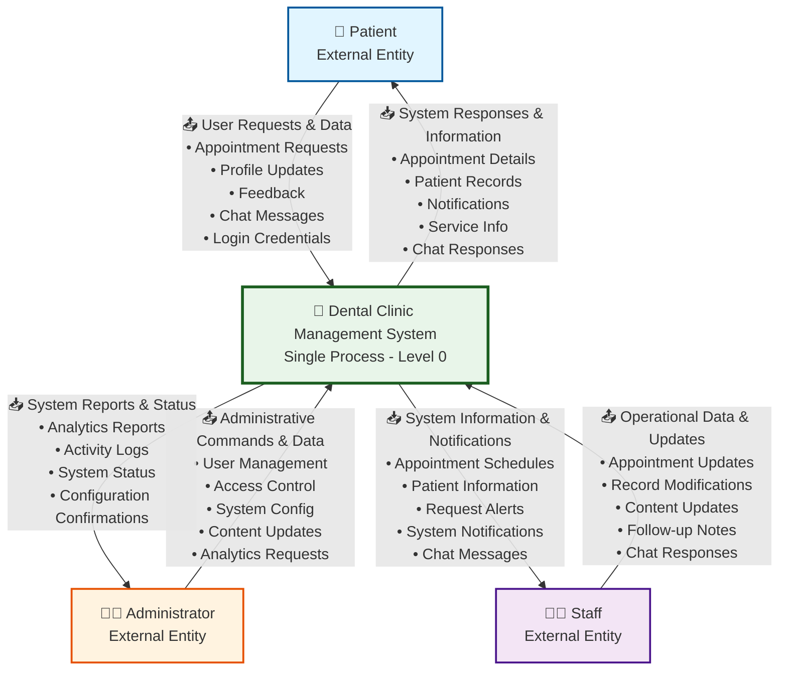
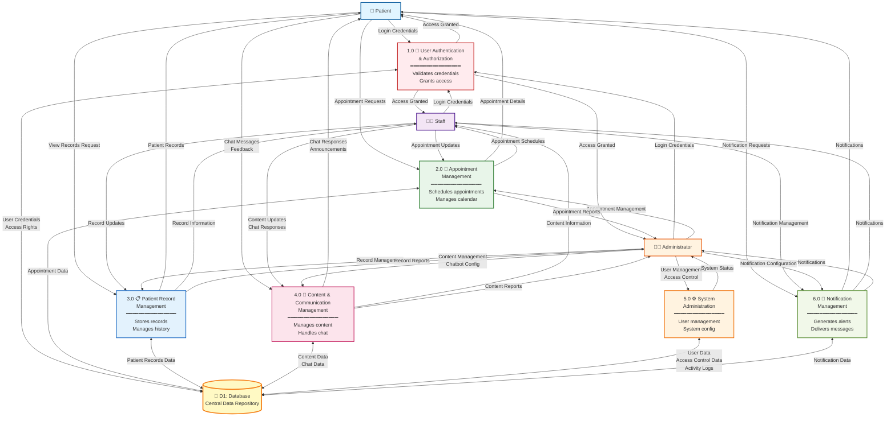
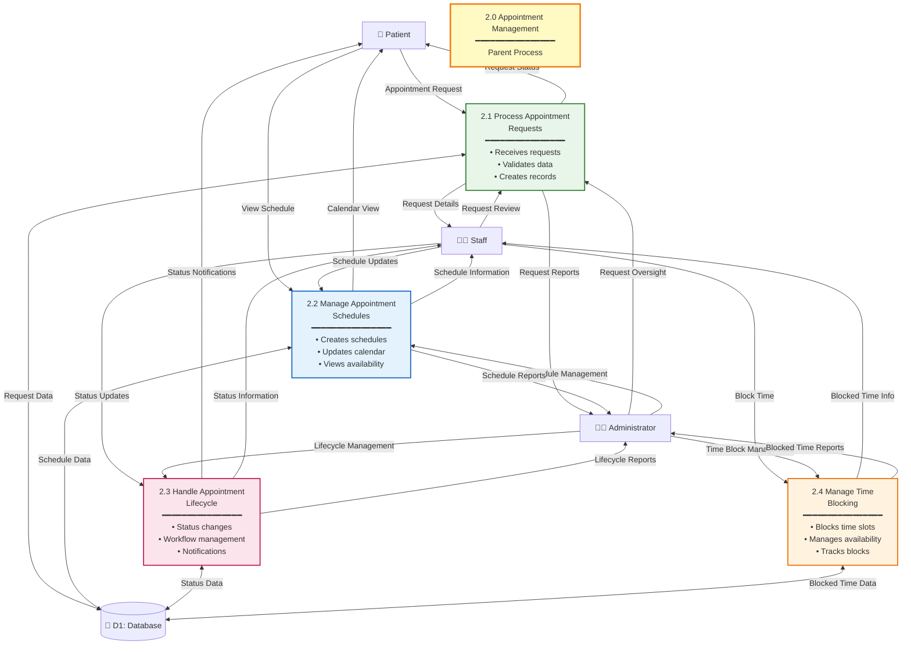
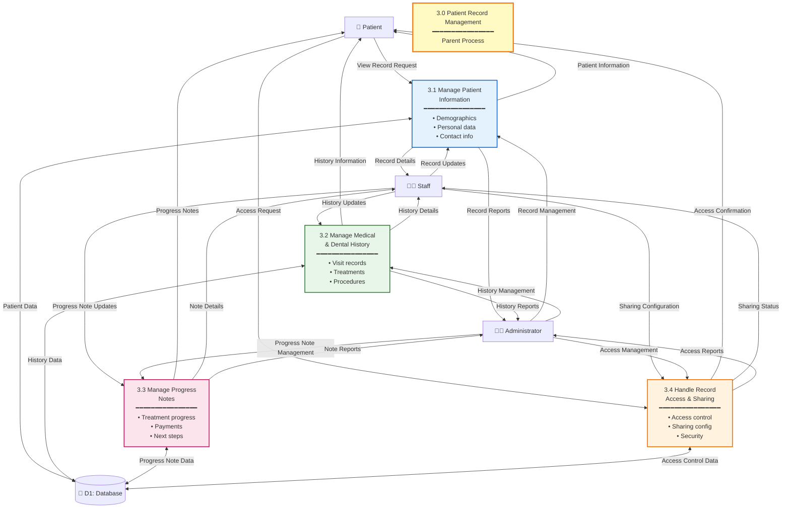
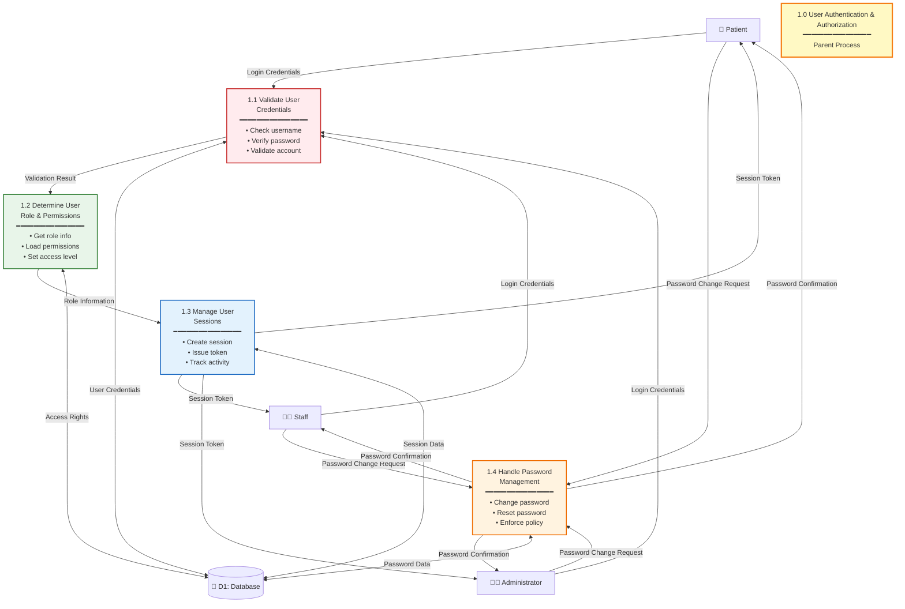

# Detailed Visual Explanation of DFD Diagrams
## Dental Clinic Management System

> **Purpose:** This document provides detailed visual explanations of all DFD diagrams with enhanced annotations, visual guides, and step-by-step explanations to help understand the system architecture.

---

## Table of Contents
1. [DFD Notation Guide](#dfd-notation-guide)
2. [DFD Level 0 - Detailed Visual Explanation](#dfd-level-0---detailed-visual-explanation)
3. [DFD Level 1 - Detailed Visual Explanation](#dfd-level-1---detailed-visual-explanation)
4. [DFD Level 2 - Detailed Visual Explanations](#dfd-level-2---detailed-visual-explanations)

---

## DFD Notation Guide

### Standard DFD Symbols

```
┌─────────────┐
│   Entity    │  = External Entity (Person, Organization, System)
└─────────────┘

┌─────────────┐
│  Process   │  = Process (Function that transforms data)
└─────────────┘

┌─────────────┐
│   (D1)      │  = Data Store (Database, File, Repository)
│  Database   │
└─────────────┘

    ────→      = Data Flow (Direction of data movement)
```

### Visual Legend

- **External Entities**: Rectangles with rounded corners (Users, Organizations)
- **Processes**: Rounded rectangles (System Functions)
- **Data Stores**: Open rectangles (Databases, Files)
- **Data Flows**: Arrows with labels (Data moving between components)

---

## DFD Level 0 - Detailed Visual Explanation

### Visual Description Overview

The DFD Level 0, also known as the Context Diagram, serves as the foundational view of the Dental Clinic Management System by presenting the entire system as a single, unified process that interacts with external entities. This diagram establishes the system boundary, clearly delineating what exists inside the system versus what exists outside in the external environment. The primary purpose of this level is to provide a high-level overview that focuses exclusively on external interactions without revealing any internal system structure or processes. This context diagram acts as the foundation for all subsequent DFD levels, establishing the scope of the system and identifying all external entities that interact with it, while maintaining a simplified view that emphasizes the system's role as a black box that transforms inputs from external sources into outputs delivered back to those same external entities.

### Visual Description: System Architecture

The system architecture at Level 0 demonstrates a clear separation between the external environment and the system itself. The external environment contains three distinct external entities: Patient, Administrator, and Staff, each representing different user types that interact with the system from outside its boundaries. These external entities are positioned outside the system boundary, indicating they are not part of the system but rather interact with it through data flows. The system boundary acts as a conceptual barrier that separates what is internal to the system from what is external, with the Dental Clinic Management System existing as a single, unified process within this boundary. The system is represented as a black box at this level, meaning its internal structure, processes, and operations are not visible or detailed, focusing instead on how the system interfaces with external entities through bidirectional data flows that move information both into and out of the system.

### Visual Description: Data Flow Patterns

The data flow patterns at Level 0 illustrate the bidirectional nature of information exchange between external entities and the system. For patients, the data flow pattern shows that patients send user requests and data to the system, which includes appointment requests for scheduling dental visits, profile updates to maintain their personal information, feedback submissions to rate services and provide comments, and chat messages to communicate with clinic staff. In return, the system provides system responses and information to patients, including appointment details with confirmation information and schedule data, patient records containing medical and dental history, notifications about appointment reminders and system updates, and service information about available dental services and clinic announcements.

For administrators, the data flow pattern demonstrates that administrators send administrative commands and data to the system, encompassing user management operations for creating, modifying, or deleting user accounts, access control configurations that define permissions and capabilities for staff members, and system configuration settings that control system behavior and parameters. The system responds to administrators with system reports and status information, including comprehensive analytics and performance metrics that provide insights into system usage and clinic operations, activity logs that track all system actions for audit and compliance purposes, and system status information that indicates the current operational state of the system.

For staff members, the data flow pattern reveals that staff send operational data and updates to the system, including appointment updates such as schedule modifications, status changes, and appointment confirmations, record modifications that update patient information, medical history, and treatment notes, and content updates for announcements, services, and clinic information. The system provides staff members with system information and notifications, including appointment schedules and patient calendars that help manage daily operations, patient information and records necessary for providing care, appointment requests requiring review and approval, system notifications and alerts about important events, and chat messages from patients that need responses.

### Enhanced Visual Diagram with Annotations



### Detailed Visual Breakdown

#### Component 1: External Entities (Input Sources)

```
┌─────────────────────────────────────────────────────────┐
│                    EXTERNAL ENTITIES                     │
│         (Sources and Destinations of Data)               │
└─────────────────────────────────────────────────────────┘

┌──────────────┐      ┌──────────────┐      ┌──────────────┐
│   Patient    │      │Administrator │      │    Staff     │
│              │      │              │      │              │
│ • End User   │      │ • System     │      │ • Clinic     │
│ • Receives   │      │   Manager    │      │   Employee   │
│   Services   │      │ • Full       │      │ • Daily      │
│ • Limited    │      │   Access     │      │   Operations │
│   Access     │      │ • Oversight  │      │ • Patient    │
│              │      │              │      │   Care       │
└──────────────┘      └──────────────┘      └──────────────┘
     │                      │                      │
     │                      │                      │
     └──────────────────────┼──────────────────────┘
                            │
                    All send data TO system
                    All receive data FROM system
```

**Visual Explanation:**
- **Patient** (Blue): Primary service recipient, sends requests and receives information
- **Administrator** (Orange): System manager, sends commands and receives reports
- **Staff** (Purple): Operational users, send updates and receive operational information

#### Component 2: System Process (Central Processing Unit)

```
┌─────────────────────────────────────────────────────────┐
│                                                         │
│         DENTAL CLINIC MANAGEMENT SYSTEM                 │
│                                                         │
│  ┌─────────────────────────────────────────────────┐   │
│  │                                                 │   │
│  │  This single process represents the ENTIRE      │   │
│  │  system at Level 0. It:                        │   │
│  │                                                 │   │
│  │  ✓ Receives all input from external entities   │   │
│  │  ✓ Processes all requests and commands         │   │
│  │  ✓ Generates all outputs to external entities  │   │
│  │  ✓ Maintains system state and data            │   │
│  │                                                 │   │
│  │  Internal structure is NOT shown at Level 0    │   │
│  │  (revealed in Level 1 and below)              │   │
│  │                                                 │   │
│  └─────────────────────────────────────────────────┘   │
│                                                         │
└─────────────────────────────────────────────────────────┘
```

**Visual Explanation:**
- The system is shown as ONE unified process
- All complexity is hidden at this level
- Acts as a "black box" that transforms inputs to outputs

#### Component 3: Data Flows (Information Pathways)

```
PATIENT DATA FLOWS:
┌─────────┐                                    ┌─────────┐
│ Patient │ ──────── User Requests ──────────→ │ System │
│         │                                    │         │
│         │ ←──── System Responses ─────────── │         │
└─────────┘                                    └─────────┘

ADMIN DATA FLOWS:
┌──────────────┐                              ┌─────────┐
│Administrator│ ─── Admin Commands ────────→ │ System │
│             │                              │         │
│             │ ←─── System Reports ───────── │         │
└──────────────┘                              └─────────┘

STAFF DATA FLOWS:
┌─────────┐                                    ┌─────────┐
│  Staff  │ ───── Operational Updates ────────→ │ System │
│         │                                    │         │
│         │ ←─── System Information ────────── │         │
└─────────┘                                    └─────────┘
```

**Visual Explanation:**
- **Bidirectional flows**: Data moves both TO and FROM the system
- **Grouped data**: Multiple data items grouped into logical categories
- **Direction matters**: Arrows show data direction

### Step-by-Step Visual Walkthrough

#### Step 1: Patient Interaction Flow

```
┌─────────────────────────────────────────────────────────┐
│              PATIENT INTERACTION SEQUENCE                │
└─────────────────────────────────────────────────────────┘

1. PATIENT SENDS REQUEST
   ┌─────────┐
   │ Patient │ ──────[Appointment Request]─────────→
   └─────────┘

2. SYSTEM PROCESSES REQUEST
                    ┌─────────┐
                    │ System  │ (Processes internally)
                    └─────────┘

3. SYSTEM SENDS RESPONSE
   ┌─────────┐
   │ Patient │ ←────[Appointment Confirmation]──────
   └─────────┘
```

#### Step 2: Administrator Interaction Flow

```
┌─────────────────────────────────────────────────────────┐
│          ADMINISTRATOR INTERACTION SEQUENCE              │
└─────────────────────────────────────────────────────────┘

1. ADMIN SENDS COMMAND
   ┌──────────────┐
   │Administrator│ ──────[User Management Command]───→
   └──────────────┘

2. SYSTEM PROCESSES COMMAND
                    ┌─────────┐
                    │ System  │ (Executes command)
                    └─────────┘

3. SYSTEM SENDS REPORT
   ┌──────────────┐
   │Administrator│ ←────[User Management Report]─────
   └──────────────┘
```

#### Step 3: Staff Interaction Flow

```
┌─────────────────────────────────────────────────────────┐
│             STAFF INTERACTION SEQUENCE                    │
└─────────────────────────────────────────────────────────┘

1. STAFF SENDS UPDATE
   ┌─────────┐
   │  Staff  │ ──────[Appointment Status Update]──────→
   └─────────┘

2. SYSTEM PROCESSES UPDATE
                    ┌─────────┐
                    │ System  │ (Updates database)
                    └─────────┘

3. SYSTEM SENDS INFORMATION
   ┌─────────┐
   │  Staff  │ ←────[Updated Schedule Information]─────
   └─────────┘
```

### Visual Summary of Level 0

```
                    ┌─────────────────────┐
                    │   SYSTEM BOUNDARY   │
                    └─────────────────────┘
                            │
        ┌───────────────────┼───────────────────┐
        │                   │                   │
   ┌────▼────┐        ┌────▼────┐        ┌────▼────┐
   │ Patient │        │   Admin │        │  Staff  │
   │(External)│        │(External)│        │(External)│
   └────┬────┘        └────┬────┘        └────┬────┘
        │                  │                  │
        └──────────────────┼──────────────────┘
                           │
                  ┌────────▼────────┐
                  │                 │
                  │  SYSTEM (L0)    │
                  │                 │
                  └─────────────────┘
```

**Key Visual Points:**
- ✅ Three external entities outside system boundary
- ✅ One system process inside boundary
- ✅ Bidirectional data flows between entities and system
- ✅ No internal structure visible (that's Level 1)

---

## DFD Level 1 - Detailed Visual Explanation

### Visual Description Overview

The DFD Level 1 diagram serves the critical purpose of decomposing the single system process from Level 0 into six major functional processes that represent the core capabilities of the Dental Clinic Management System. This decomposition reveals the internal system structure by showing how the system is organized into distinct functional areas, each handling specific aspects of clinic operations. The diagram demonstrates how these processes interact with each other and with external entities, providing a comprehensive view of the system's internal architecture. Additionally, Level 1 introduces data stores for the first time, specifically the database that serves as the central repository for all system data. This introduction of data stores shows how the system maintains data persistence, with the database acting as a centralized data management component that all processes interact with to store and retrieve information, ensuring data consistency and integrity across the entire system.

### Visual Description: Process Decomposition

The process decomposition from Level 0 to Level 1 represents a fundamental transformation in how the system is viewed and understood. At Level 0, the system exists as a single, unified process that functions as a black box, with no internal structure visible and all complexity hidden from view. This single process receives inputs from external entities and produces outputs, but the mechanisms by which these transformations occur remain concealed. When we move to Level 1, this single process is decomposed into six distinct functional processes, each representing a major area of system functionality. Process 1.0 handles User Authentication and Authorization, ensuring secure access to the system. Process 2.0 manages Appointments, handling all aspects of scheduling and appointment lifecycle. Process 3.0 manages Patient Records, maintaining comprehensive medical and dental information. Process 4.0 handles Content and Communication, managing announcements, chat, and feedback. Process 5.0 provides System Administration capabilities for managing users and system configuration. Process 6.0 manages Notifications, generating and delivering alerts and messages throughout the system. This decomposition reveals the internal organization of the system, showing how complex functionality is divided into manageable, focused processes that work together to provide comprehensive clinic management capabilities.

### Visual Description: Process Categories

The six major processes in Level 1 can be logically categorized into four functional layers that represent different aspects of system functionality. The Security Layer contains Process 1.0, User Authentication and Authorization, which handles login operations, access control, and permission management, serving as the entry point and security gateway for all system users. The Operations Layer encompasses Process 2.0, Appointment Management, which handles scheduling, calendar management, and appointment lifecycle, and Process 3.0, Patient Record Management, which manages patient information, medical and dental history, and progress notes. These operational processes form the core of daily clinic operations, enabling staff to manage appointments and maintain comprehensive patient records.

The Communication Layer includes Process 4.0, Content and Communication Management, which handles announcements, chat communications, chatbot interactions, and feedback processing, and Process 6.0, Notification Management, which generates alerts, manages notification delivery, and tracks notification status. These processes facilitate information exchange and communication between the clinic and patients, as well as within the clinic staff. The Administration Layer consists of Process 5.0, System Administration, which provides user management capabilities, access control configuration, system monitoring, and activity logging. This layer is exclusively accessible to administrators and provides the tools necessary for system oversight and management. Together, these four layers create a comprehensive system architecture that addresses security, operations, communication, and administration needs of the dental clinic.

### Visual Description: Data Store Integration

The database, represented as D1, serves as the central data repository that all processes interact with to maintain system data. This centralized database stores comprehensive information including user credentials and account data, appointment schedules and details, patient records and medical history, content such as announcements and services, and system logs for audit and monitoring purposes. Process 1.0 reads user credentials to validate login attempts and writes session information to maintain authenticated user sessions. Process 2.0 reads appointment data to display schedules and calendars, and writes appointment information when creating, updating, or modifying appointments. Process 3.0 reads patient records to display patient information and writes record updates when staff modify patient data or add new information.

Process 4.0 reads content data to display announcements, services, and chat conversations, and writes content updates when staff or administrators modify announcements, services, or respond to chat messages. Process 5.0 reads user data and access control configurations to manage user accounts and permissions, and writes configuration updates when administrators modify user settings or access controls. Process 6.0 reads notification data to display notifications to users and writes notification records when generating new notifications or updating notification status. The fact that all processes share the same database ensures data consistency across the entire system, prevents data duplication, and provides a single source of truth for all system information. This centralized data management approach simplifies data maintenance, ensures referential integrity, and enables comprehensive data analysis and reporting capabilities.

### Enhanced Visual Diagram with Annotations



### Detailed Visual Breakdown

#### Component 1: Process Decomposition Visualization

```
LEVEL 0 (Single Process)              LEVEL 1 (Decomposed)
┌─────────────────────┐              ┌─────────────────────┐
│                     │              │                     │
│   SYSTEM (L0)       │    ─────→    │  Process 1.0       │
│                     │              │  Process 2.0       │
│  [Black Box]        │              │  Process 3.0       │
│                     │              │  Process 4.0       │
│                     │              │  Process 5.0       │
│                     │              │  Process 6.0       │
└─────────────────────┘              └─────────────────────┘
     (What)                                (How)
```

**Visual Explanation:**
- Level 0 shows WHAT the system does
- Level 1 shows HOW the system does it (internal structure)

#### Component 2: Process Categories Visual Map

```
┌─────────────────────────────────────────────────────────┐
│              PROCESS FUNCTIONAL CATEGORIES                │
└─────────────────────────────────────────────────────────┘

┌──────────────────┐  ┌──────────────────┐  ┌──────────────────┐
│  SECURITY        │  │  OPERATIONS      │  │  COMMUNICATION   │
│                  │  │                  │  │                  │
│  1.0 Auth &      │  │  2.0 Appointment │  │  4.0 Content &   │
│      Auth        │  │     Management   │  │     Communication│
│                  │  │                  │  │                  │
│                  │  │  3.0 Patient     │  │  6.0 Notification│
│                  │  │     Records      │  │     Management   │
│                  │  │                  │  │                  │
└──────────────────┘  └──────────────────┘  └──────────────────┘

┌──────────────────┐
│  ADMINISTRATION   │
│                  │
│  5.0 System       │
│     Administration│
│                  │
└──────────────────┘
```

#### Component 3: Data Store Introduction

```
┌─────────────────────────────────────────────────────────┐
│              DATA STORE (First Appearance)               │
└─────────────────────────────────────────────────────────┘

                    ┌──────────────┐
                    │              │
                    │   DATABASE   │
                    │              │
                    │  • Users     │
                    │  • Appointments│
                    │  • Records   │
                    │  • Content   │
                    │  • Logs      │
                    │              │
                    └──────────────┘
                         ▲    │
                         │    │
                    Read │    │ Write
                         │    │
        ┌────────────────┘    └────────────────┐
        │                                       │
   ┌────▼────┐                            ┌────▼────┐
   │Process 1│                            │Process 2│
   │Process 3│                            │Process 4│
   │Process 5│                            │Process 6│
   └─────────┘                            └─────────┘

All processes interact with the SAME database
```

### Step-by-Step Visual Walkthrough

#### Step 1: Authentication Flow (Process 1.0)

```
┌─────────────────────────────────────────────────────────┐
│         AUTHENTICATION FLOW VISUALIZATION                │
└─────────────────────────────────────────────────────────┘

1. USER ATTEMPTS LOGIN
   ┌─────────┐
   │ Patient │ ──────[Username + Password]─────────→
   └─────────┘

2. PROCESS VALIDATES
                    ┌──────────────┐
                    │   Process    │
                    │   1.0 Auth   │
                    │              │
                    │  • Checks    │
                    │    credentials│
                    │  • Retrieves │
                    │    role info │
                    └──────┬───────┘
                           │
                           │ Query
                           ▼
                    ┌──────────────┐
                    │   Database   │
                    │  (User Data)│
                    └──────┬───────┘
                           │
                           │ Results
                           ▼
                    ┌──────────────┐
                    │   Process    │
                    │   1.0 Auth   │
                    └──────┬───────┘

3. ACCESS GRANTED
   ┌─────────┐
   │ Patient │ ←────[Access Token + Role]──────────
   └─────────┘
```

#### Step 2: Appointment Management Flow (Process 2.0)

```
┌─────────────────────────────────────────────────────────┐
│       APPOINTMENT MANAGEMENT FLOW VISUALIZATION          │
└─────────────────────────────────────────────────────────┘

PATIENT REQUEST PATH:
┌─────────┐
│ Patient │ ──────[New Appointment Request]─────────→
└─────────┘
          │
          ▼
┌─────────────────────┐
│  Process 2.0        │
│  Appointment Mgmt    │
│                     │
│  • Validates        │
│  • Checks schedule  │
│  • Creates record   │
└──────────┬──────────┘
           │
           │ Store
           ▼
┌─────────────────────┐
│   Database          │
│  (Appointment Data) │
└──────────┬──────────┘
           │
           │ Retrieve
           ▼
┌─────────────────────┐
│  Process 2.0        │
└──────────┬──────────┘
           │
           ▼
┌─────────┐
│ Patient │ ←────[Appointment Confirmation]─────────
└─────────┘
```

#### Step 3: Multi-User Process Interaction

```
┌─────────────────────────────────────────────────────────┐
│      MULTI-USER PROCESS INTERACTION VISUALIZATION         │
└─────────────────────────────────────────────────────────┘

                    ┌─────────────────┐
                    │  Process 2.0     │
                    │  Appointment     │
                    │  Management      │
                    └────────┬─────────┘
                             │
        ┌────────────────────┼────────────────────┐
        │                    │                    │
        ▼                    ▼                    ▼
   ┌─────────┐         ┌─────────┐         ┌─────────┐
   │ Patient │         │  Staff  │         │  Admin  │
   │         │         │         │         │         │
   │ Sends:  │         │ Sends:  │         │ Sends:  │
   │ Request │         │ Updates │         │ Commands│
   │         │         │         │         │         │
   │ Gets:   │         │ Gets:   │         │ Gets:   │
   │ Details │         │ Schedule│         │ Reports │
   └─────────┘         └─────────┘         └─────────┘

SAME PROCESS serves ALL users with different:
• Input types
• Output types
• Access levels (internal to process)
```

### Visual Process Interaction Matrix

```
┌─────────────────────────────────────────────────────────┐
│         PROCESS-ENTITY INTERACTION MATRIX                │
└─────────────────────────────────────────────────────────┘

Process          │ Patient │ Staff │ Admin │ Database │
─────────────────┼─────────┼───────┼───────┼──────────┤
1.0 Auth         │    ✓    │   ✓   │   ✓   │    ✓     │
2.0 Appointment  │    ✓    │   ✓   │   ✓   │    ✓     │
3.0 Records      │    ✓    │   ✓   │   ✓   │    ✓     │
4.0 Content      │    ✓    │   ✓   │   ✓   │    ✓     │
5.0 Admin        │    ✗    │   ✗   │   ✓   │    ✓     │
6.0 Notification │    ✓    │   ✓   │   ✓   │    ✓     │

Legend: ✓ = Interacts  ✗ = No Interaction
```

### Visual Summary of Level 1

```
                    ┌─────────────────────┐
                    │   SYSTEM BOUNDARY   │
                    └─────────────────────┘
                            │
        ┌───────────────────┼───────────────────┐
        │                   │                   │
   ┌────▼────┐        ┌────▼────┐        ┌────▼────┐
   │ Patient │        │   Admin │        │  Staff  │
   └────┬────┘        └────┬────┘        └────┬────┘
        │                  │                  │
        └──────────────────┼──────────────────┘
                           │
        ┌──────────────────┼──────────────────┐
        │                  │                  │
   ┌────▼────┐       ┌─────▼─────┐      ┌────▼────┐
   │Process 1│       │ Process 2 │      │Process 3│
   │Process 4│       │ Process 5 │      │Process 6│
   └────┬────┘       └─────┬─────┘      └────┬────┘
        │                  │                  │
        └──────────────────┼──────────────────┘
                           │
                    ┌──────▼──────┐
                    │  Database   │
                    └─────────────┘
```

**Key Visual Points:**
- ✅ System decomposed into 6 functional processes
- ✅ All external entities interact with multiple processes
- ✅ Database introduced as central data store
- ✅ Processes represent functions, not user views

---

## DFD Level 2 - Detailed Visual Explanations

### Visual Description: Level 2 Overview

The DFD Level 2 diagrams serve the purpose of decomposing selected Level 1 processes into detailed sub-processes, typically breaking down each major process into four sub-processes that handle specific aspects of the parent process's functionality. This decomposition reveals the internal process structure by showing how each major process works internally, detailing the specific responsibilities of each sub-process, and illustrating the detailed data flows that occur within the process. Level 2 provides implementation details that are essential for system development, including step-by-step operations that show the sequence of activities within each process, process sequences that demonstrate how sub-processes interact with each other, and data transformation details that explain how data is modified as it moves through the system.

The decomposition strategy for Level 2 focuses on only the key processes that require detailed examination, typically selecting the most complex processes that have significant internal functionality, critical business functions that are central to system operations, and processes that require detailed understanding for implementation or maintenance purposes. Not all Level 1 processes are decomposed to Level 2, as this would create excessive detail and complexity. Instead, the most important or complex processes are selected for decomposition, providing detailed views of critical system functionality while maintaining overall diagram readability and usefulness.

### Visual Description: Decomposition Pattern

The decomposition pattern from Level 1 to Level 2 follows a consistent structure where each Level 1 process, which appears as a single, unified process handling multiple related functions, is broken down into four sub-processes that each handle a specific aspect of the parent process's functionality. For example, a Level 1 process that handles functions A, B, C, and D will be decomposed into sub-process X.1 that handles Function 1, sub-process X.2 that handles Function 2, sub-process X.3 that handles Function 3, and sub-process X.4 that handles Function 4. Each sub-process has clearly defined responsibilities and focuses on a specific aspect of the parent process's operations, allowing for detailed understanding of how complex processes are internally structured and how different functions within a process interact with each other and with external entities and data stores.

### 2.0 Appointment Management (Level 2) - Visual Explanation

### Visual Description: Appointment Management Structure

The Appointment Management process at Level 2 is decomposed into four sub-processes that handle different aspects of appointment operations. Sub-process 2.1, Process Appointment Requests, handles the initial creation and review of appointment requests submitted by patients, receiving requests from users, validating request data to ensure completeness and accuracy, creating appointment records in the database, and initiating review workflows that route requests to appropriate staff members for approval or denial. Sub-process 2.2, Manage Appointment Schedules, handles schedule creation and maintenance by creating appointment schedules based on approved requests, updating calendar views to reflect current appointment status, managing availability to ensure time slots are properly allocated, and handling schedule modifications when appointments need to be rescheduled or cancelled.

Sub-process 2.3, Handle Appointment Lifecycle, manages the progression of appointments through various status stages by managing status transitions from pending to confirmed to completed or cancelled, tracking appointment progress throughout the lifecycle, generating status notifications to inform patients and staff of changes, and maintaining lifecycle history that documents all status changes and their timestamps. Sub-process 2.4, Manage Time Blocking, handles the creation and management of blocked time slots by creating time blocks for clinic closures, staff unavailability, or special events, managing blocked periods to ensure they are properly maintained and removed when no longer needed, preventing scheduling conflicts by ensuring appointments cannot be scheduled during blocked periods, and tracking availability to provide accurate information about available time slots for appointment scheduling.

#### Enhanced Diagram with Detailed Annotations



#### Visual Decomposition Explanation

```
LEVEL 1 Process              LEVEL 2 Sub-Processes
┌─────────────────────┐     ┌─────────────────────┐
│                     │     │                     │
│  2.0 Appointment    │ ──→ │  2.1 Process        │
│     Management      │     │     Requests        │
│                     │     │                     │
│  [Single Process]   │     │  2.2 Manage         │
│                     │     │     Schedules       │
│                     │     │                     │
│                     │     │  2.3 Handle         │
│                     │     │     Lifecycle       │
│                     │     │                     │
│                     │     │  2.4 Manage        │
│                     │     │     Time Blocking   │
│                     │     │                     │
└─────────────────────┘     └─────────────────────┘
```

#### Sub-Process Flow Visualization

```
APPOINTMENT REQUEST LIFECYCLE:

1. REQUEST CREATION (2.1)
   ┌─────────┐
   │ Patient │ ───[Request]──→ 2.1 Process Requests
   └─────────┘                    │
                                   │ Store
                                   ▼
                            ┌──────────┐
                            │ Database │
                            └──────────┘

2. SCHEDULE MANAGEMENT (2.2)
                            ┌──────────┐
                            │ Database │
                            └────┬─────┘
                                 │ Retrieve
                                 ▼
                         2.2 Manage Schedules
                                 │
                                 │ Update
                                 ▼
                            ┌──────────┐
                            │ Database │
                            └──────────┘

3. STATUS UPDATES (2.3)
   ┌─────────┐
   │  Staff  │ ───[Status Change]──→ 2.3 Handle Lifecycle
   └─────────┘                            │
                                           │ Update
                                           ▼
                                    ┌──────────┐
                                    │ Database │
                                    └──────────┘

4. TIME BLOCKING (2.4)
   ┌─────────┐
   │  Staff  │ ───[Block Time]──→ 2.4 Manage Time Blocking
   └─────────┘                         │
                                       │ Store
                                       ▼
                                ┌──────────┐
                                │ Database │
                                └──────────┘
```

### 3.0 Patient Record Management (Level 2) - Visual Explanation

### Visual Description: Patient Record Management Structure

The Patient Record Management process at Level 2 is decomposed into four sub-processes that handle different aspects of patient record operations. Sub-process 3.1, Manage Patient Information, handles the core demographic and personal information that forms the foundation of patient records, managing demographics such as age, gender, and address, updating personal data when patients provide new information, maintaining contact information including phone numbers and email addresses, and storing basic medical information such as allergies and current medications. Sub-process 3.2, Manage Medical & Dental History, handles comprehensive historical documentation by documenting each patient visit with details about the visit date and purpose, maintaining treatment records that describe procedures performed and outcomes achieved, tracking procedure history to show all treatments a patient has received over time, and storing clinical notes that provide detailed information about diagnoses, treatment plans, and clinical observations.

Sub-process 3.3, Manage Progress Notes, handles ongoing treatment documentation by tracking treatment progress to monitor how patients respond to treatments over time, maintaining payment information including amounts paid and remaining balances, documenting next steps in treatment plans to guide future care, and tracking patient responses to treatments to assess effectiveness. Sub-process 3.4, Handle Record Access & Sharing, manages security and access control by implementing access control management that determines who can view or modify records, configuring sharing settings that control how records are shared with patients or other healthcare providers, enforcing security policies to protect sensitive patient information, and validating permissions to ensure users only access records they are authorized to view. Together, these four sub-processes ensure that patient records are comprehensive, secure, and accessible to authorized users while maintaining privacy and compliance with healthcare regulations.

#### Enhanced Diagram with Detailed Annotations



#### Record Management Flow Visualization

```
PATIENT RECORD STRUCTURE:

┌─────────────────────────────────────────┐
│     3.0 Patient Record Management       │
│                                         │
│  ┌──────────────┐  ┌──────────────┐   │
│  │  3.1 Patient │  │  3.2 Medical  │   │
│  │  Information │  │  & Dental    │   │
│  │              │  │  History     │   │
│  │ • Demographics│  │ • Visits     │   │
│  │ • Contact    │  │ • Treatments │   │
│  │ • Personal   │  │ • Procedures │   │
│  └──────┬───────┘  └──────┬───────┘   │
│         │                 │            │
│         └────────┬─────────┘            │
│                  │                      │
│         ┌────────▼────────┐             │
│         │  3.3 Progress   │             │
│         │     Notes       │             │
│         │                 │             │
│         │ • Treatment     │             │
│         │ • Payments      │             │
│         │ • Next Steps    │             │
│         └────────┬────────┘             │
│                  │                      │
│         ┌────────▼────────┐             │
│         │  3.4 Access &   │             │
│         │    Sharing     │             │
│         │                 │             │
│         │ • Security      │             │
│         │ • Permissions   │             │
│         │ • Sharing       │             │
│         └─────────────────┘             │
└─────────────────────────────────────────┘
```

### 1.0 User Authentication & Authorization (Level 2) - Visual Explanation

### Visual Description: Authentication Structure

The User Authentication and Authorization process at Level 2 is decomposed into four sub-processes that handle different aspects of user authentication and access control. Sub-process 1.1, Validate User Credentials, serves as the initial security checkpoint by performing username or email verification to ensure the user account exists in the system, validating passwords using secure hashing algorithms to verify the provided password matches the stored password, checking account status to ensure the account is active and not locked or suspended, and performing security checks such as detecting multiple failed login attempts or suspicious activity patterns. Sub-process 1.2, Determine User Role & Permissions, handles access control by identifying the user's role whether they are a patient, staff member, or administrator, loading permissions associated with that role from the database, determining the access level that defines what system functions the user can access, and assigning capabilities that specify what actions the user can perform within the system.

Sub-process 1.3, Manage User Sessions, handles session management by creating authenticated user sessions after successful login, generating session tokens that serve as identifiers for maintaining the authenticated state, tracking active sessions to monitor user activity and detect security issues, and managing session timeouts to automatically log out inactive users after a specified period. Sub-process 1.4, Handle Password Management, manages password-related operations by processing password changes when users want to update their passwords, handling password resets for users who have forgotten their passwords through secure reset token mechanisms, enforcing password policies that require passwords to meet security requirements such as minimum length and complexity, and performing security validation to ensure password changes comply with security standards and prevent password reuse. Together, these four sub-processes create a comprehensive security system that protects user accounts, enforces access control, and maintains security throughout user interactions with the system.

### Visual Description: Authentication Flow Sequence

The authentication flow sequence demonstrates the step-by-step process that occurs when a user attempts to log into the system. The sequence begins when a user submits login credentials, which are received by sub-process 1.1, Validate User Credentials. This sub-process then queries the database to retrieve stored user credentials and account information, comparing the provided credentials against the stored data to verify their authenticity. Once validation is complete, the sub-process passes the validation result to sub-process 1.2, Determine User Role & Permissions, which queries the database to retrieve the user's role information and associated permissions. This sub-process then determines the appropriate access level and capabilities for the authenticated user based on their role.

The role and permission information is then passed to sub-process 1.3, Manage User Sessions, which creates an authenticated user session and generates a session token that will be used to maintain the user's authenticated state. The session information is stored in the database to track the active session and enable session management features such as timeout handling and activity monitoring. Finally, the session token is returned to the user, completing the authentication process and granting the user access to system functions appropriate to their role and permissions. This sequential flow ensures that each step of the authentication process is completed before moving to the next, maintaining security and ensuring that only properly authenticated and authorized users gain access to the system.

#### Enhanced Diagram with Detailed Annotations



#### Authentication Flow Sequence Visualization

```
AUTHENTICATION SEQUENCE DIAGRAM:

User                   1.1 Validate    1.2 Determine  1.3 Manage     Database
                        Credentials    Role & Perm    Sessions
  │                         │              │            │              │
  │───[Login]──────────────>│              │            │              │
  │                         │              │            │              │
  │                         │───[Query]───────────────────────────────>│
  │                         │              │            │              │
  │                         │<──[Results]──────────────────────────────│
  │                         │              │            │              │
  │                         │───[Valid]───>│            │              │
  │                         │              │            │              │
  │                         │              │───[Query]───────────────>│
  │                         │              │            │              │
  │                         │              │<──[Role]─────────────────│
  │                         │              │            │              │
  │                         │              │───[Role Info]───────────>│
  │                         │              │            │              │
  │                         │              │            │───[Store]───>│
  │                         │              │            │              │
  │<──[Session Token]──────────────────────────────────────────────────│
  │                         │              │            │              │
```

---

## Visual Comparison: Level 0 vs Level 1 vs Level 2

```
LEVEL 0 (Context)          LEVEL 1 (Decomposition)      LEVEL 2 (Detail)
┌─────────────────┐       ┌─────────────────┐         ┌─────────────────┐
│                 │       │                 │         │                 │
│   SYSTEM        │       │  Process 1.0     │         │  1.1 Sub-Proc   │
│                 │       │  Process 2.0     │         │  1.2 Sub-Proc   │
│  [One Process]  │  ──→  │  Process 3.0     │   ──→   │  1.3 Sub-Proc   │
│                 │       │  Process 4.0     │         │  1.4 Sub-Proc   │
│                 │       │  Process 5.0     │         │                 │
│                 │       │  Process 6.0     │         │  [One Process   │
│                 │       │                 │         │   Decomposed]   │
└─────────────────┘       └─────────────────┘         └─────────────────┘

Detail Level:    Low              Medium                  High
Complexity:      Simple           Moderate                Detailed
Purpose:         Overview         Architecture            Implementation
```

---

## Visual Summary: Complete DFD Hierarchy

```
                    ┌─────────────────────────┐
                    │   LEVEL 0: CONTEXT      │
                    │                         │
                    │  [System as One]        │
                    └───────────┬─────────────┘
                                │
                                │ Decompose
                                ▼
                    ┌─────────────────────────┐
                    │   LEVEL 1: PROCESSES    │
                    │                         │
                    │  [6 Major Processes]    │
                    └───────────┬─────────────┘
                                │
                                │ Decompose Key Processes
                                ▼
                    ┌─────────────────────────┐
                    │   LEVEL 2: SUB-PROCESSES│
                    │                         │
                    │  [4 Sub-Processes each] │
                    └─────────────────────────┘

Each level reveals more detail while maintaining
the same system boundary and external entities.
```

---

**Document Version:** 1.0  
**Last Updated:** 2025  
**System:** Dental Clinic Management System


