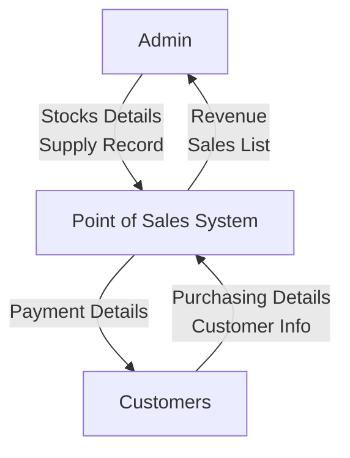

# DFD Level 0 - Context Diagram
## Point of Sales (POS) System

> **Note:** This document provides the DFD Level 0 (Context Diagram) for the Point of Sales System, showing the system boundary and interactions with external entities.

---

## DFD Level 0 - Context Diagram

### Diagram



### ASCII Representation

```
┌─────────┐
│  Admin  │
└────┬────┘
     │
     │ Stocks Details
     │ Supply Record
     │
     │ Revenue
     │ Sales List
     │
     ▼
┌──────────────────────────────────────┐
│                                      │
│      Point of Sales System           │
│                                      │
└──────────────────────────────────────┘
     ▲
     │
     │ Purchasing Details
     │ Customer Info
     │
     │ Payment Details
     │
┌────┴────┐
│Customers│
└─────────┘
```

### Data Flow Notation

**Admin ↔ Point of Sales System:**
- Admin → Stocks Details → Point of Sales System
- Admin → Supply Record → Point of Sales System
- Point of Sales System → Revenue → Admin
- Point of Sales System → Sales List → Admin

**Customers ↔ Point of Sales System:**
- Customers → Purchasing Details → Point of Sales System
- Customers → Customer Info → Point of Sales System
- Point of Sales System → Payment Details → Customers

### Description

**DFD Level 0 - Context Diagram for Point of Sales System**

This DFD Level 0 represents the Context Process of the Point of Sales System, illustrating high-level data flows between two external entities (Admin and Customers) and the central Point of Sales System.

The **Admin** entity sends inventory and supply information to the system, including:
- **Stocks Details**: Information about product inventory levels, stock quantities, and product availability
- **Supply Record**: Records of incoming supplies, restocking information, and inventory updates

The system provides administrative reports and financial information to the Admin, including:
- **Revenue**: Financial reports showing sales revenue, profit margins, and financial summaries
- **Sales List**: Detailed reports of all sales transactions, sales history, and transaction records

The **Customers** entity sends transaction and personal information to the system, including:
- **Purchasing Details**: Information about items being purchased, quantities, product selections, and purchase requests
- **Customer Info**: Customer personal information, contact details, and customer profile data

The system provides transaction confirmation and payment information to Customers, including:
- **Payment Details**: Payment confirmations, receipt information, transaction summaries, and payment status

The Point of Sales System serves as the central processing unit managing all sales transactions, inventory management, customer interactions, and administrative reporting. This context diagram establishes the system boundary and identifies all external entities that interact with the system without revealing any internal system structure or processes.

---

**Document Version:** 1.0  
**Last Updated:** 2025  
**System:** Point of Sales (POS) System


