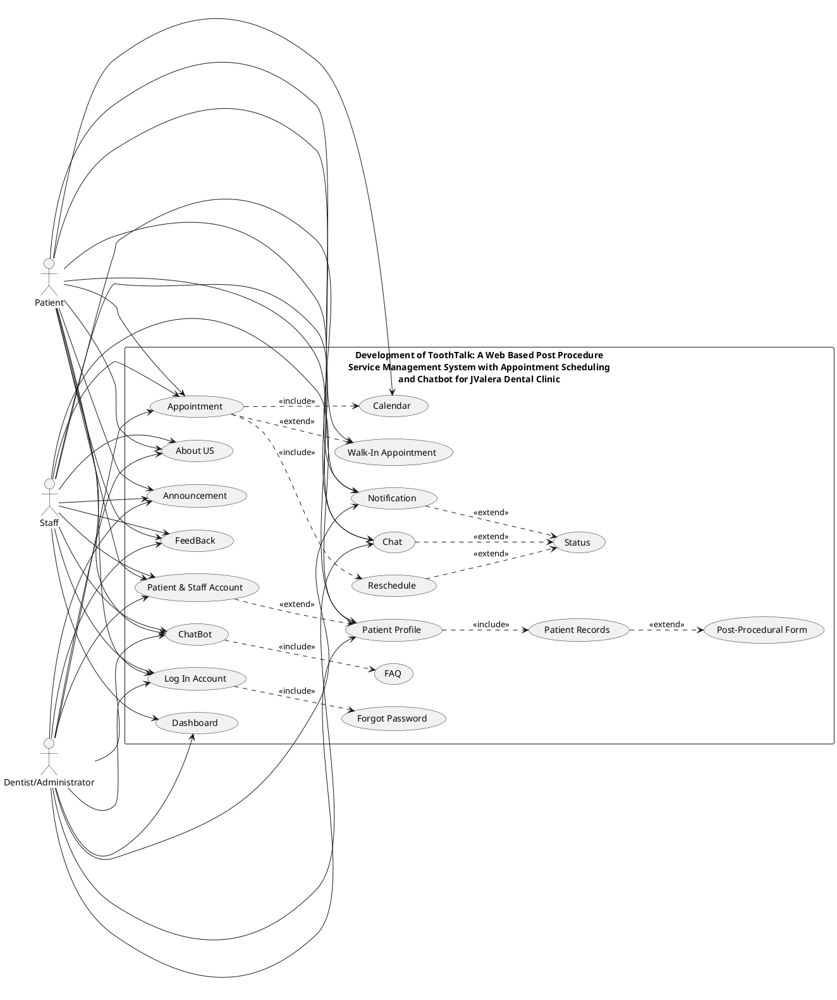
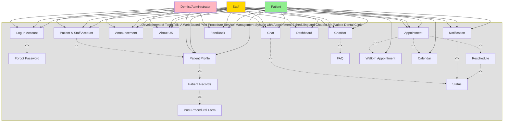
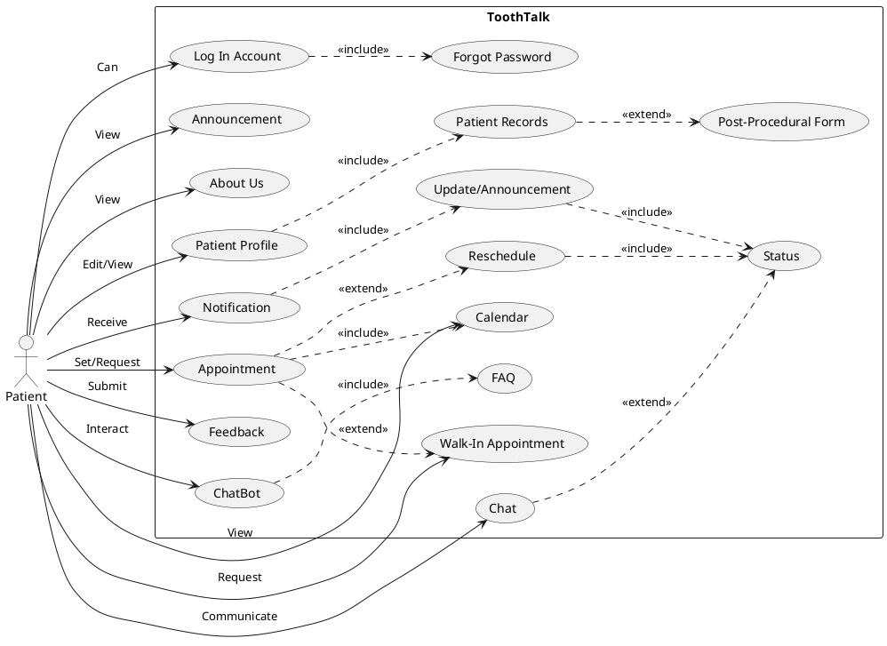
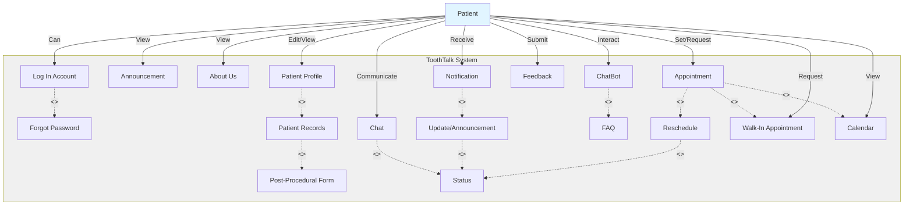
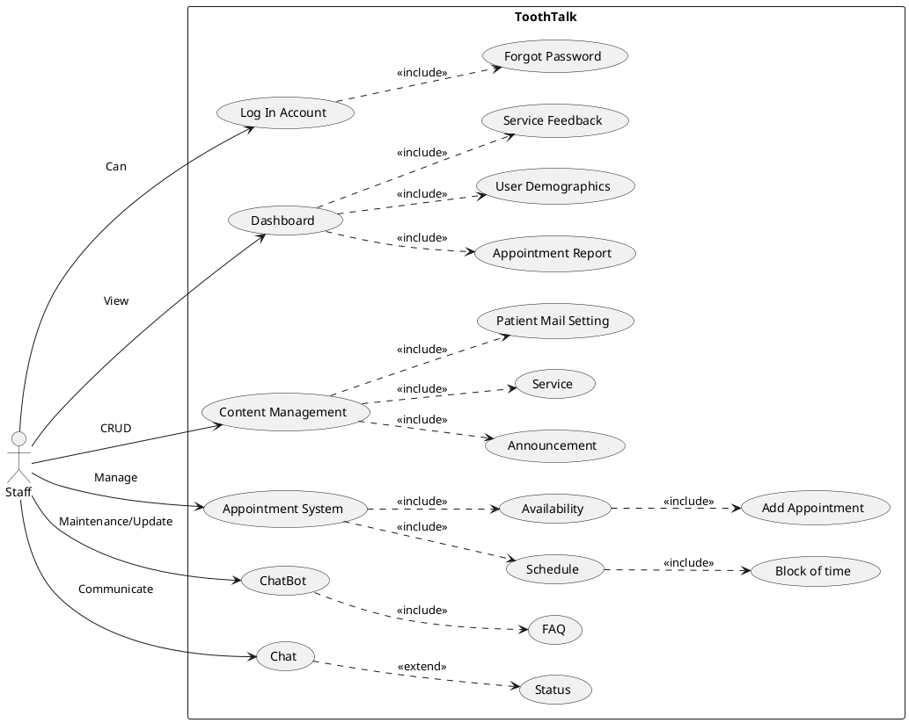
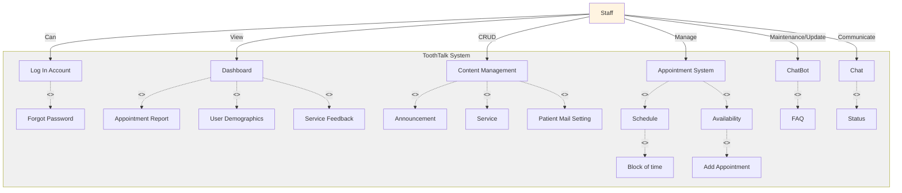
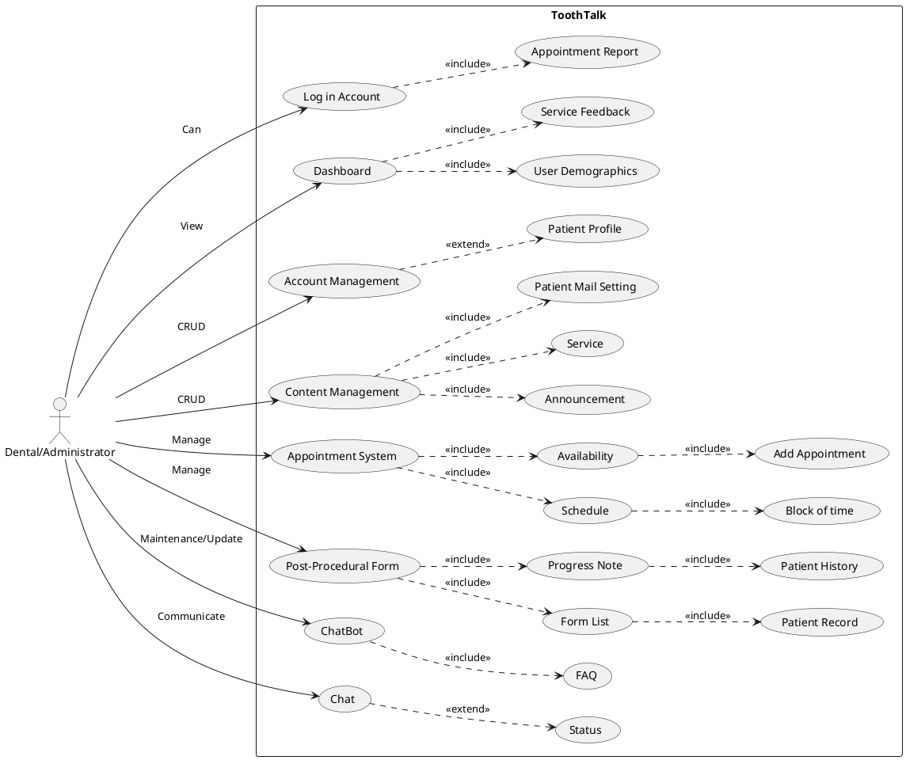
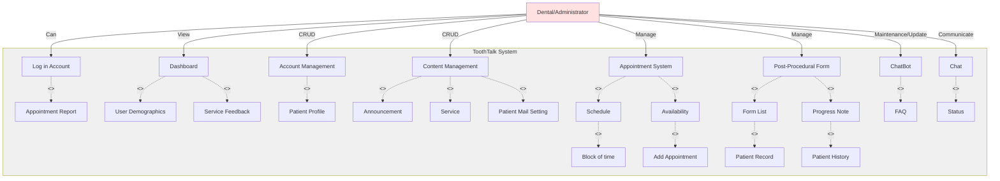

# Use Case Diagram
## Dental Clinic Management System (ToothTalk)

> **Note:** This document provides comprehensive use case diagrams for each user role in the Dental Clinic Management System, illustrating all major functionalities and their relationships.

---

## Table of Contents
1. [System Overview](#system-overview)
2. [General Use Case Diagram (Patient, Staff & Administrator)](#general-use-case-diagram-patient-staff--administrator)
3. [Patient Use Case Diagram](#1-patient-use-case-diagram)
4. [Staff Use Case Diagram](#2-staff-use-case-diagram)
5. [Administrator Use Case Diagram](#3-administrator-use-case-diagram)
6. [Summary](#summary)

---

## System Overview

### System Name
**ToothTalk** - Dental Clinic Management System

### System Purpose
The ToothTalk system is designed to handle:
- Post-procedure services and patient record management
- Appointment scheduling and management
- Chatbot services (ToothTalk Chatbot) for patient support
- Content management (announcements, services, events)
- User management and access control
- System administration and monitoring

### User Types (Actors)
1. **Patient** - End users receiving dental services
2. **Staff** - Clinic employees managing daily operations
3. **Dentist/Administrator** - System administrators with full access

### Core Functionalities (Common to All Roles)
- Logging into accounts (includes password recovery)
- Managing profiles
- Managing patient records (may include post-procedural forms)
- Viewing announcements
- Handling appointments (e.g., rescheduling, checking status)
- Receiving notifications
- Providing feedback
- Interacting with the chatbot FAQ section

### Additional Functionalities (Administrator Only)
- Manage patient accounts
- Manage staff accounts
- System configuration and monitoring
- Activity log management

---

## General Use Case Diagram (Patient, Staff & Administrator)

### System Title
**Development of ToothTalk: A Web Based Post Procedure Service Management System with Appointment Scheduling and Chatbot for JValera Dental Clinic**

### PlantUML Format



### Mermaid Format



### Data Flow Notation for General Use Case Diagram

This notation format provides a structured way to visualize the combined Patient, Staff, and Administrator use case diagram.

```
ACTORS:
- Patient (Green)
- Staff (Yellow/Gold)
- Dentist/Administrator (Red)

SYSTEM BOUNDARY:
"Development of ToothTalk: A Web Based Post Procedure Service Management 
System with Appointment Scheduling and Chatbot for JValera Dental Clinic"

PRIMARY USE CASES (Shared by All Three Actors):
┌──────────────────────────────────────────────────────────────────────┐
│ Use Case ID │ Use Case Name           │ Patient │ Staff │ Administrator│
├─────────────┼────────────────────────┼─────────┼───────┼──────────────┤
│ UC01        │ Log In Account          │    ✓    │   ✓   │       ✓       │
│ UC03        │ Patient & Staff Account │    ✓    │   ✓   │       ✓       │
│ UC04        │ Patient Profile         │    ✓    │   ✓   │       ✓       │
│ UC07        │ Announcement            │    ✓    │   ✓   │       ✓       │
│ UC08        │ About US                │    ✓    │   ✓   │       ✓       │
│ UC09        │ Appointment             │    ✓    │   ✓   │       ✓       │
│ UC12        │ Notification            │    ✓    │   ✓   │       ✓       │
│ UC13        │ FeedBack                │    ✓    │   ✓   │       ✓       │
│ UC14        │ ChatBot                 │    ✓    │   ✓   │       ✓       │
│ UC16        │ Chat                    │    ✓    │   ✓   │       ✓       │
└──────────────────────────────────────────────────────────────────────┘

PRIMARY USE CASES (Patient Only):
┌──────────────────────────────────────────────────────────────────────┐
│ Use Case ID │ Use Case Name           │ Patient │ Staff │ Administrator│
├─────────────┼────────────────────────┼─────────┼───────┼──────────────┤
│ UC18        │ Walk-In Appointment     │    ✓    │   -   │       -       │
│ UC19        │ Calendar                │    ✓    │   -   │       -       │
└──────────────────────────────────────────────────────────────────────┘

PRIMARY USE CASES (Staff & Administrator Only):
┌──────────────────────────────────────────────────────────────────────┐
│ Use Case ID │ Use Case Name           │ Patient │ Staff │ Administrator│
├─────────────┼────────────────────────┼─────────┼───────┼──────────────┤
│ UC17        │ Dashboard               │    -    │   ✓   │       ✓       │
└──────────────────────────────────────────────────────────────────────┘

USE CASE RELATIONSHIPS:

1. LOG IN ACCOUNT (UC01)
   └─> [INCLUDE] → Forgot Password (UC02)
       Meaning: Forgot Password is mandatory part of Log In Account

2. PATIENT & STAFF ACCOUNT (UC03)
   └─> [EXTEND] → Patient Profile (UC04)
       Meaning: Patient Profile is optional extension of Patient & Staff Account

3. PATIENT PROFILE (UC04)
   └─> [INCLUDE] → Patient Records (UC05)
       └─> [EXTEND] → Post-Procedural Form (UC06)
           Meaning: Patient Records is mandatory part of Patient Profile
           Meaning: Post-Procedural Form is optional extension of Patient Records

4. APPOINTMENT (UC09)
   └─> [INCLUDE] → Reschedule (UC10)
   └─> [EXTEND] → Walk-In Appointment (UC18)
   └─> [INCLUDE] → Calendar (UC19)
       Meaning: Reschedule is mandatory part of Appointment
       Meaning: Walk-In Appointment is optional extension of Appointment
       Meaning: Calendar is mandatory part of Appointment

5. RESCHEDULE (UC10)
   └─> [EXTEND] → Status (UC11)
       Meaning: Status is optional extension of Reschedule

6. NOTIFICATION (UC12)
   └─> [EXTEND] → Status (UC11)
       Meaning: Status is optional extension of Notification

7. CHATBOT (UC14)
   └─> [INCLUDE] → FAQ (UC15)
       Meaning: FAQ is mandatory part of ChatBot

8. CHAT (UC16)
   └─> [EXTEND] → Status (UC11)
       Meaning: Status is optional extension of Chat

DATA FLOW SUMMARY:
───────────────────────────────────────────────────────────────────
Patient, Staff & Administrator → Log In Account
         ↓
         └─> [INCLUDE] → Forgot Password

Patient, Staff & Administrator → Patient & Staff Account
         ↓
         └─> [EXTEND] → Patient Profile
             ↓
             └─> [INCLUDE] → Patient Records
                 ↓
                 └─> [EXTEND] → Post-Procedural Form

Patient, Staff & Administrator → Announcement

Patient, Staff & Administrator → About US

Patient, Staff & Administrator → Appointment
         ↓
         ├─> [INCLUDE] → Reschedule
         │   └─> [EXTEND] → Status
         ├─> [EXTEND] → Walk-In Appointment (Patient only)
         └─> [INCLUDE] → Calendar (Patient only)

Patient, Staff & Administrator → Notification
         ↓
         └─> [EXTEND] → Status

Patient, Staff & Administrator → FeedBack

Patient, Staff & Administrator → ChatBot
         ↓
         └─> [INCLUDE] → FAQ

Patient, Staff & Administrator → Chat
         ↓
         └─> [EXTEND] → Status

Staff & Administrator → Dashboard
───────────────────────────────────────────────────────────────────

RELATIONSHIP TYPES:
- [INCLUDE]: Mandatory relationship - included use case always executes
- [EXTEND]: Optional relationship - extended use case may execute conditionally

VISUALIZATION GUIDE:
───────────────────────────────────────────────────────────────────
Actors (Patient, Staff, Dentist/Administrator) → Primary Use Cases
    - Shared by all: 10 use cases
    - Patient only: 2 use cases (Walk-In Appointment, Calendar)
    - Staff & Admin only: 1 use case (Dashboard)
    ↓
    Include Relationships (mandatory)
    Extend Relationships (optional)
    ↓
    Secondary Use Cases (6 total)

Total Use Cases: 19
- Primary (directly connected to actors): 13
  * Shared by all three: 10
  * Patient only: 2
  * Staff & Admin only: 1
- Secondary (connected via relationships): 6
```

### General Use Case Diagram Explanation

This use case diagram illustrates the shared functionalities available to the **Patient**, **Staff**, and **Dentist/Administrator** actors within the ToothTalk system. The diagram shows common use cases that all three actors can access, along with their relationships and dependencies. The entire system is enclosed within a rectangle labeled "Development of ToothTalk: A Web Based Post Procedure Service Management System with Appointment Scheduling and Chatbot for JValera Dental Clinic" at the top, representing the complete scope of the system.

The diagram features three primary actors: **Patient**, represented by a green stick figure connected to use cases via green lines; **Staff**, represented by a yellow/gold stick figure connected via yellow lines; and **Dentist/Administrator**, represented by a red stick figure connected via red lines. All three actors share access to core functionalities including **Log In Account** for authentication, which includes the **Forgot Password** functionality as a mandatory component, meaning password recovery is mandatory during login. They can also manage **Patient & Staff Account**, which optionally extends to **Patient Profile** management, meaning profile viewing is optional when managing accounts. The **Patient Profile** use case includes **Patient Records** as a mandatory component, meaning records are mandatory when viewing profile, and **Patient Records** can optionally extend to **Post-Procedural Form**, meaning forms are optional when viewing records.

All three actors can view **Announcement** and **About US** pages to access clinic information and updates. The **Appointment** use case is shared by all actors and includes **Reschedule** as a mandatory component, meaning rescheduling is mandatory in appointment management, while **Calendar** is mandatory for appointment management, particularly for patients. Additionally, **Appointment** can optionally extend to **Walk-In Appointment**, which is specifically available to patients for emergency or urgent appointment requests. The **Reschedule** use case can optionally extend to **Status** checking, meaning status checking is optional when rescheduling, allowing users to verify appointment status when rescheduling.

The **Notification** use case enables all actors to receive notifications, which can optionally extend to **Status** checking, meaning status checking is optional when viewing notifications, for viewing the status of related items. All actors can submit **FeedBack** to provide ratings and comments about their experience. The **ChatBot** use case allows interaction with the ToothTalk chatbot, which includes **FAQ** as a mandatory component, meaning FAQ is mandatory when using chatbot, providing answers based on frequently asked questions. The **Chat** use case enables live chat communication between patients and staff/administrators, which can optionally extend to **Status** checking, meaning status checking is optional when using chat, for viewing conversation or appointment status.

Patients have exclusive access to two additional use cases: **Walk-In Appointment** for requesting emergency appointments and **Calendar** for viewing appointments in different formats (month, week, day views). Staff and Administrators share access to the **Dashboard** use case, which provides a comprehensive overview of clinic operations, statistics, and analytics.

The diagram emphasizes common use cases rather than role-specific features, with include relationships showing mandatory dependencies and extend relationships showing optional behaviors that can be triggered conditionally. This general diagram shows shared capabilities, while individual role-specific features are detailed in separate diagrams. All three actors share the same core functionalities, demonstrating the system's unified approach to common operations while maintaining role-specific capabilities where needed.

---

## 1. Patient Use Case Diagram

### PlantUML Format



### Mermaid Format



### Data Flow Notation for Patient Use Case Diagram

This notation format provides a structured way to visualize the Patient use case diagram and understand the relationships between use cases.

```
ACTOR: Patient

PRIMARY USE CASES (Direct Actor Interactions):
┌─────────────────────────────────────────────────────────────────┐
│ Use Case ID │ Use Case Name        │ Interaction Type │ Label   │
├─────────────┼─────────────────────┼──────────────────┼─────────┤
│ UC01        │ Log In Account      │ Can              │ Can     │
│ UC03        │ Announcement        │ View             │ View    │
│ UC04        │ About Us            │ View             │ View    │
│ UC05        │ Patient Profile     │ Edit/View        │ Edit/   │
│             │                     │                  │ View    │
│ UC08        │ Appointment         │ Set/Request      │ Set/    │
│             │                     │                  │ Request │
│ UC11        │ Notification        │ Receive          │ Receive │
│ UC13        │ Feedback            │ Submit           │ Submit  │
│ UC14        │ ChatBot             │ Interact         │ Interact│
│ UC16        │ Chat                │ Communicate      │ Communi │
│             │                     │                  │ cate    │
│ UC17        │ Walk-In Appointment │ Request          │ Request │
│ UC18        │ Calendar            │ View             │ View    │
└─────────────────────────────────────────────────────────────────┘

USE CASE RELATIONSHIPS:

1. LOG IN ACCOUNT (UC01)
   └─> [INCLUDE] → Forgot Password (UC02)
       Meaning: Forgot Password is mandatory part of Log In Account

2. PATIENT PROFILE (UC05)
   └─> [INCLUDE] → Patient Records (UC06)
       └─> [EXTEND] → Post-Procedural Form (UC07)
           Meaning: Patient Records is mandatory part of Patient Profile
           Meaning: Post-Procedural Form is optional extension of Patient Records

3. APPOINTMENT (UC08)
   └─> [EXTEND] → Reschedule (UC09)
   └─> [EXTEND] → Walk-In Appointment (UC17)
   └─> [INCLUDE] → Calendar (UC18)
       Meaning: Reschedule is optional extension of Appointment
       Meaning: Walk-In Appointment is optional extension of Appointment
       Meaning: Calendar is mandatory part of Appointment

4. RESCHEDULE (UC09)
   └─> [INCLUDE] → Status (UC10)
       Meaning: Status is mandatory part of Reschedule

5. NOTIFICATION (UC11)
   └─> [INCLUDE] → Update/Announcement (UC12)
       └─> [INCLUDE] → Status (UC10)
           Meaning: Update/Announcement is mandatory part of Notification
           Meaning: Status is mandatory part of Update/Announcement

6. CHATBOT (UC14)
   └─> [INCLUDE] → FAQ (UC15)
       Meaning: FAQ is mandatory part of ChatBot

7. CHAT (UC16)
   └─> [EXTEND] → Status (UC10)
       Meaning: Status is optional extension of Chat

DATA FLOW SUMMARY:
───────────────────────────────────────────────────────────────────
Patient → [Can] → Log In Account
         ↓
         └─> [INCLUDE] → Forgot Password

Patient → [View] → Announcement

Patient → [View] → About Us

Patient → [Edit/View] → Patient Profile
         ↓
         └─> [INCLUDE] → Patient Records
             ↓
             └─> [EXTEND] → Post-Procedural Form

Patient → [Set/Request] → Appointment
         ↓
         ├─> [EXTEND] → Reschedule
         │   └─> [INCLUDE] → Status
         ├─> [EXTEND] → Walk-In Appointment
         └─> [INCLUDE] → Calendar

Patient → [Receive] → Notification
         ↓
         └─> [INCLUDE] → Update/Announcement
             ↓
             └─> [INCLUDE] → Status

Patient → [Submit] → Feedback

Patient → [Interact] → ChatBot
         ↓
         └─> [INCLUDE] → FAQ

Patient → [Communicate] → Chat
         ↓
         └─> [EXTEND] → Status

Patient → [Request] → Walk-In Appointment

Patient → [View] → Calendar
───────────────────────────────────────────────────────────────────

RELATIONSHIP TYPES:
- [INCLUDE]: Mandatory relationship - included use case always executes
- [EXTEND]: Optional relationship - extended use case may execute conditionally

VISUALIZATION GUIDE:
───────────────────────────────────────────────────────────────────
Actor (Patient) → Primary Use Cases (8 total)
    ↓
    Include Relationships (mandatory)
    Extend Relationships (optional)
    ↓
    Secondary Use Cases (7 total)

Total Use Cases: 18
- Primary (directly connected to Patient): 11
- Secondary (connected via relationships): 7
```

### Patient Use Case Diagram Explanation

This use case diagram illustrates all functionalities available to the **Patient** actor within the ToothTalk system. The diagram shows the primary actions a patient can perform and the relationships between these actions, including "include" and "extend" relationships between use cases. A large rectangle encloses all the use cases and is labeled "ToothTalk" at the top, representing the scope of the system. On the left side of the diagram, a stick figure labeled **"Patient"** represents the primary actor who interacts with the system.

The Patient actor can interact with **Log In Account**, which includes **Forgot Password** as an essential part of the login process. When a patient attempts to log in, they may need to use the forgot password functionality if they cannot remember their credentials. Patients can **View** **Announcement** to see clinic announcements, updates, and important information posted by the clinic staff or administrators. They can also **View** **About Us** to access information about the clinic, including clinic history, services offered, and other relevant information.

Patients can **Edit/View** their **Patient Profile** to view and update their personal information, contact details, and profile settings. The **Patient Profile** includes **Patient Records** as a mandatory component, meaning that when viewing their profile, patients can access their medical and dental records. The **Patient Records** can optionally extend to **Post-Procedural Form**, allowing patients to view and download post-procedural forms related to their treatment after a procedure.

Patients can **Set/Request** **Appointment** to create new appointment requests or schedule appointments for dental services. The **Appointment** use case includes **Calendar** as a mandatory component, enabling patients to view their appointments in calendar format with different views (month, week, day). The **Appointment** can optionally extend to **Reschedule**, allowing patients to reschedule existing appointments when circumstances change. When rescheduling, patients need to check the **Status**, which is a mandatory part of the reschedule process. Additionally, **Appointment** can optionally extend to **Walk-In Appointment**, enabling patients to request emergency or urgent appointments that don't require prior scheduling, which is useful for immediate dental care needs.

Patients can **Receive** **Notification** about appointment confirmations, reminders, updates, and other important information. The **Notification** includes **Update/Announcement** as a mandatory component, meaning that notifications may contain updates or announcements from the clinic. The **Update/Announcement** includes **Status** as a mandatory component, allowing patients to see the status of related items such as appointment status or announcement status when viewing updates or announcements.

Patients can **Submit** **Feedback** after completing appointments to provide feedback and ratings about their experience with the clinic and the application. They can **Interact** with **ChatBot** to get answers to questions, information about services, appointment details, and other inquiries. The **ChatBot** includes **FAQ** as a mandatory component, meaning that the chatbot provides answers based on frequently asked questions stored in the system. Patients can **Communicate** via **Chat** to engage in live chat conversations with clinic staff for real-time support, inquiries, and assistance. The **Chat** can optionally extend to **Status**, allowing patients to check the status of their conversations, messages, or related appointments while chatting.

The primary use cases directly associated with Patient include Log In Account, Announcement, About Us, Patient Profile, Appointment, Notification, Feedback, ChatBot, Chat, Walk-In Appointment, and Calendar. The included use cases are Forgot Password, Patient Records, Status (from Reschedule), Update/Announcement, Status (from Update/Announcement), and FAQ. The extended use cases are Post-Procedural Form and Reschedule. These capabilities enable patients to perform self-service appointment management (create, view, reschedule), access personal medical and dental records, view clinic announcements and information, receive and manage notifications, submit feedback and ratings, interact with chatbot for support, and manage their profiles.

---

## 2. Staff Use Case Diagram

### PlantUML Format



### Mermaid Format



### Staff Use Case Diagram Explanation

This use case diagram illustrates all functionalities available to the **Staff** actor within the ToothTalk system. The diagram shows the primary actions staff members can perform to manage daily clinic operations, patient care, and system content. A large rectangle encloses all the use cases and is labeled "ToothTalk" at the top, representing the scope of the system. On the left side of the diagram, a stick figure labeled **"Staff"** represents the primary actor who interacts with the system.

The Staff actor can interact with **Log In Account**, which includes **Forgot Password** as a mandatory component. This means that logging into an account always involves the possibility of using the "Forgot Password" functionality, allowing staff members to reset their passwords if they forget their credentials.

Staff members can **View** the **Dashboard** to access a comprehensive dashboard that provides an overview of clinic operations, statistics, and important information. The **Dashboard** includes **Appointment Report** as a mandatory component, providing access to appointment reports showing scheduled appointments, completed appointments, and appointment statistics. The dashboard also includes **User Demographics** as a mandatory component, showing patient statistics, registration trends, and user distribution. Additionally, the dashboard includes **Service Feedback** as a mandatory component, displaying service feedback and ratings from patients, allowing staff to monitor patient satisfaction levels.

Staff members can perform **CRUD** (Create, Read, Update, Delete) operations on **Content Management** to manage all content displayed in the system. The **Content Management** includes **Announcement** as a mandatory component, involving creating, editing, and managing clinic announcements that are visible to patients. It also includes **Service** as a mandatory component, allowing staff to manage dental services offered by the clinic, including service descriptions, pricing, and duration settings. The **Content Management** includes **Patient Mail Setting** as a mandatory component, enabling staff to configure email templates and mail settings used for patient communications, including appointment confirmations, reminders, and notifications.

Staff members can **Manage** the **Appointment System** with full control over the appointment scheduling system. The **Appointment System** includes **Schedule** as a mandatory component, involving managing the overall schedule, including viewing all appointments and scheduling conflicts. The **Schedule** includes **Block of time** as a mandatory component, allowing staff to block specific time slots to prevent appointment scheduling, such as for lunch breaks, meetings, or clinic closures. The **Appointment System** also includes **Availability** as a mandatory component, enabling staff to manage appointment availability, including setting available time slots and managing appointment capacity. The **Availability** includes **Add Appointment** as a mandatory component, providing the ability to add new appointments to the system, either by creating appointments directly or approving patient appointment requests.

Staff members can perform **Maintenance/Update** on the **ChatBot** to maintain and update the ToothTalk chatbot system. The **ChatBot** includes **FAQ** as a mandatory component, meaning that maintaining the chatbot involves managing frequently asked questions (FAQs) that the chatbot uses to provide answers to patient inquiries. Staff can add, edit, or remove FAQ entries.

Staff members can **Communicate** via **Chat** to engage in live chat conversations with patients for real-time support, inquiries, and assistance. The **Chat** can optionally extend to **Status**, meaning that checking "Status" is an optional extension when using chat, allowing staff to check the status of conversations, messages, or related appointments while chatting.

The primary use cases directly associated with Staff include Log In Account, Dashboard, Content Management, Appointment System, ChatBot, and Chat. The included use cases are Forgot Password, Appointment Report, User Demographics, Service Feedback, Announcement, Service, Patient Mail Setting, Schedule, Availability, Block of time, Add Appointment, and FAQ. These capabilities enable staff to view comprehensive dashboards with reports and statistics, manage all clinic content (announcements, services, email templates), perform full appointment system management (schedule, availability, blocking time), maintain and update chatbot FAQs, engage in live chat communication with patients, access all patient data for operational purposes, review and approve appointment requests, and manage patient records and post-procedural forms.

---

## 3. Administrator Use Case Diagram

### PlantUML Format



### Mermaid Format



### Administrator Use Case Diagram Explanation

This use case diagram illustrates all functionalities available to the **Dental/Administrator** actor within the ToothTalk system. The diagram shows the primary actions administrators can perform to manage the complete system, including user accounts, appointments, content, patient records, and system configuration. A large rectangle encloses all the use cases and is labeled "ToothTalk" at the top, representing the scope of the system. On the left side of the diagram, a stick figure labeled **"Dental/Administrator"** represents the primary actor who has complete system access and control.

The Dental/Administrator actor can interact with **Log in Account**, which includes **Appointment Report** as a mandatory component. When administrators log in, they can access appointment reports that provide comprehensive information about all appointments in the system, including statistics, trends, and detailed appointment data.

Administrators can **View** the **Dashboard** to access a comprehensive dashboard that provides system-wide overview and statistics. The **Dashboard** includes **User Demographics** as a mandatory component, showing detailed user demographics including patient and staff statistics, registration trends, user distribution, and other demographic information. The dashboard also includes **Service Feedback** as a mandatory component, displaying service feedback and ratings from all patients, allowing administrators to monitor overall patient satisfaction, identify trends, and analyze feedback data.

Administrators can perform **CRUD** (Create, Read, Update, Delete) operations on **Account Management** with full control over all user accounts in the system. The **Account Management** can optionally extend to **Patient Profile**, meaning that account management can include patient profile management. Administrators can create, edit, and manage patient accounts, including all profile information, personal details, and account settings. This optional extension allows administrators to manage patient profiles as part of account management.

Administrators can perform **CRUD** operations on **Content Management** with complete control over all content displayed in the system. The **Content Management** includes **Announcement** as a mandatory component, involving creating, editing, deleting, and archiving clinic announcements that are visible to patients and staff. It also includes **Service** as a mandatory component, allowing administrators to manage all dental services offered by the clinic, including service descriptions, pricing, duration settings, and service availability. The **Content Management** includes **Patient Mail Setting** as a mandatory component, enabling administrators to configure email templates and mail settings used for all patient communications, including appointment confirmations, reminders, cancellations, rescheduling notices, and follow-up messages.

Administrators can **Manage** the **Appointment System** with complete oversight and control over the appointment scheduling system. The **Appointment System** includes **Schedule** as a mandatory component, involving managing the overall schedule, including viewing all appointments across the system, identifying scheduling conflicts, and managing appointment distribution. The **Schedule** includes **Block of time** as a mandatory component, allowing administrators to block specific time slots to prevent appointment scheduling, such as for holidays, clinic closures, staff unavailability, or special events. The **Appointment System** also includes **Availability** as a mandatory component, enabling administrators to manage appointment availability system-wide, including setting available time slots, managing appointment capacity, and configuring availability rules. The **Availability** includes **Add Appointment** as a mandatory component, providing the ability to add new appointments to the system, either by creating appointments directly for any patient or approving patient appointment requests.

Administrators can **Manage** **Post-Procedural Form** to create, edit, and manage post-procedural forms for patients. The **Post-Procedural Form** includes **Form List** as a mandatory component, involving viewing and managing a list of all forms in the system. The **Form List** includes **Patient Record** as a mandatory component, meaning that viewing the form list includes accessing patient records, as forms are associated with specific patient records and appointments. The **Post-Procedural Form** also includes **Progress Note** as a mandatory component, involving creating and managing progress notes that track patient treatment progress and outcomes. The **Progress Note** includes **Patient History** as a mandatory component, meaning that creating and managing progress notes includes accessing and updating patient history, as progress notes are part of the patient's treatment history.

Administrators can perform **Maintenance/Update** on the **ChatBot** with complete control over the ToothTalk chatbot system. The **ChatBot** includes **FAQ** as a mandatory component, meaning that maintaining the chatbot involves managing frequently asked questions (FAQs) that the chatbot uses to provide answers to patient inquiries. Administrators can add, edit, remove, and organize FAQ entries, control FAQ display order, and activate or deactivate specific FAQs.

Administrators can **Communicate** via **Chat** to engage in live chat conversations with patients for real-time support, inquiries, and assistance. The **Chat** can optionally extend to **Status**, meaning that checking "Status" is an optional extension when using chat, allowing administrators to check the status of conversations, messages, or related appointments while chatting.

The primary use cases directly associated with Administrator include Log in Account, Dashboard, Account Management, Content Management, Appointment System, Post-Procedural Form, ChatBot, and Chat. The included use cases are Appointment Report, User Demographics, Service Feedback, Patient Profile (extended), Announcement, Service, Patient Mail Setting, Schedule, Availability, Block of time, Add Appointment, Form List, Progress Note, Patient Record, Patient History, and FAQ. The extended use cases are Patient Profile (from Account Management). These capabilities enable administrators to have complete system access and control, manage user accounts (patients, staff, and other administrators), access comprehensive dashboards with system-wide statistics and reports, perform full content management (announcements, services, email templates), provide complete appointment system oversight and management, manage post-procedural forms and patient records, configure and maintain the chatbot, engage in live chat communication with patients, perform system configuration and monitoring, access and analyze activity logs, and manage security. Additionally, administrators have exclusive features including managing staff accounts and permissions, configuring staff access controls, viewing and managing activity logs, performing system-wide notification management, exporting data and generating reports, monitoring password resets and security events, and managing fully booked days.
- Archive and restore announcements
- Complete system administration capabilities

---

## Summary

### System Overview Summary

**ToothTalk** is a comprehensive Dental Clinic Management System designed for the JValera Dental Clinic. The system handles post-procedure services, appointment scheduling, and chatbot services to streamline clinic operations and improve patient experience.

### User Roles and Capabilities

#### Patient Role
- **Total Primary Use Cases:** 8
- **Key Capabilities:**
  - Self-service appointment management (create, view, reschedule)
  - Access to personal medical and dental records
  - View clinic announcements and information
  - Receive and manage notifications
  - Submit feedback and ratings
  - Interact with chatbot for support
  - Profile management

#### Staff Role
- **Total Primary Use Cases:** 5
- **Key Capabilities:**
  - View comprehensive dashboard with reports and statistics
  - Manage all clinic content (announcements, services, email templates)
  - Full appointment system management (schedule, availability, blocking time)
  - Maintain and update chatbot FAQs
  - Access to all patient data for operational purposes
  - Review and approve appointment requests
  - Manage patient records and post-procedural forms

#### Administrator Role
- **Total Primary Use Cases:** 7
- **Key Capabilities:**
  - Complete system access and control
  - User account management (patients, staff, and other administrators)
  - Comprehensive dashboard with system-wide statistics and reports
  - Full content management (announcements, services, email templates)
  - Complete appointment system oversight and management
  - Post-procedural form and patient record management
  - Chatbot configuration and maintenance
  - System configuration and monitoring
  - Activity log access and analysis
  - Security management and oversight

### Common Functionalities Across All Roles
- Logging into accounts (includes password recovery)
- Managing profiles
- Managing patient records (may include post-procedural forms)
- Viewing announcements
- Handling appointments (e.g., rescheduling, checking status)
- Receiving notifications
- Providing feedback
- Interacting with the chatbot FAQ section

### Administrator-Only Additional Functionalities
- Manage patient accounts
- Manage staff accounts
- System configuration and monitoring
- Activity log management
- Complete security oversight
- Data export and reporting

### Use Case Relationship Types

**Include Relationship (<<include>>):**
- Indicates that the included use case is a mandatory part of the base use case's functionality
- The included use case must always be executed when the base use case is performed
- Example: "Log In Account" always includes "Forgot Password" functionality

**Extend Relationship (<<extend>>):**
- Indicates that the extended use case is an optional, additional functionality
- The extended use case may be performed conditionally in the context of the base use case
- Example: "Reschedule" extends "Appointment" - rescheduling is optional and only occurs when needed

### System Benefits

1. **For Patients:**
   - Easy appointment scheduling and management
   - Access to personal records and treatment history
   - Real-time notifications and updates
   - 24/7 chatbot support
   - Convenient feedback submission

2. **For Staff:**
   - Streamlined appointment management
   - Efficient content management
   - Comprehensive dashboard for operations overview
   - Easy access to all patient information
   - Chatbot maintenance capabilities

3. **For Administrators:**
   - Complete system control and oversight
   - Comprehensive user management
   - System-wide monitoring and analytics
   - Security and access control management
   - Full configuration capabilities

---

**Document Version:** 1.0  
**Last Updated:** 2025  
**System:** Dental Clinic Management System (ToothTalk)  
**Framework:** Laravel (PHP)
